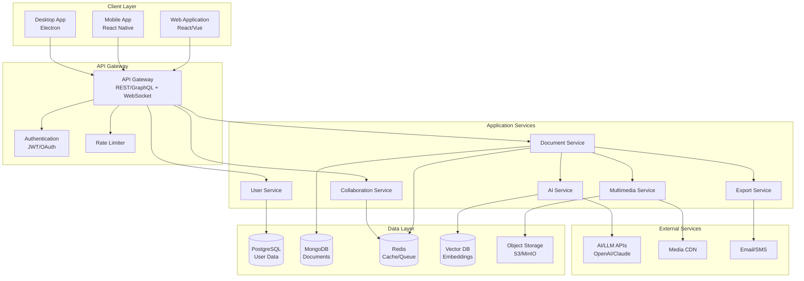
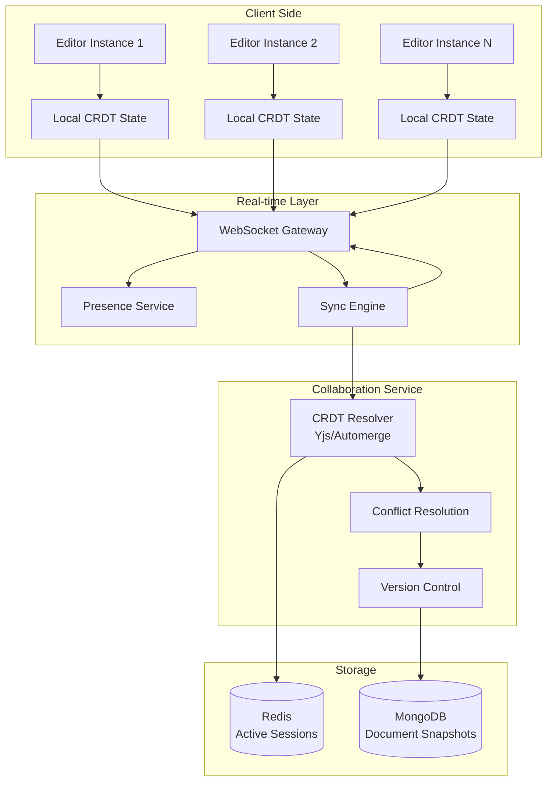
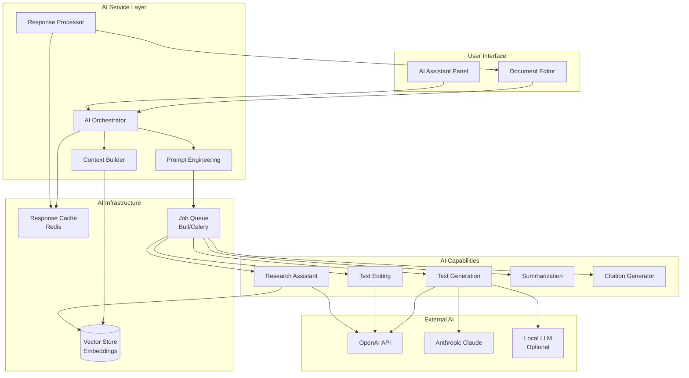
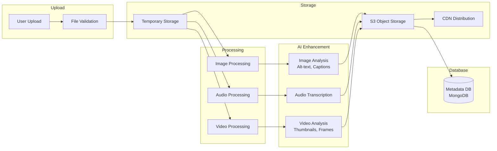
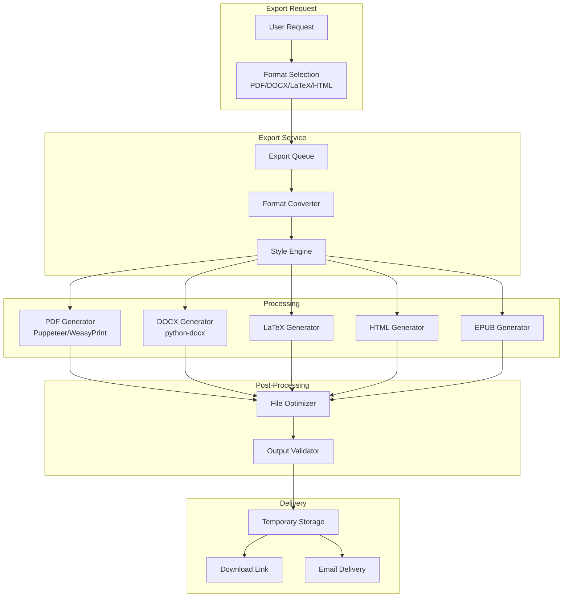
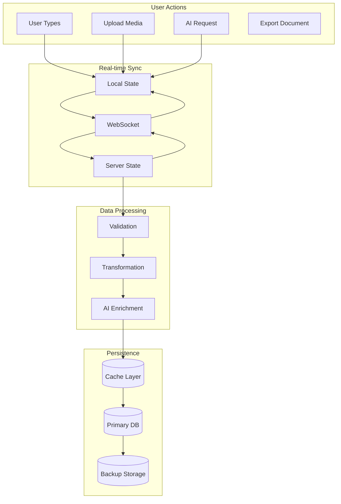
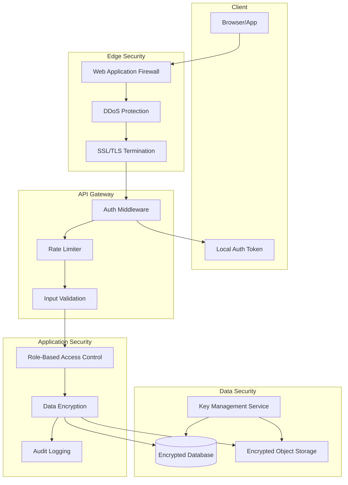
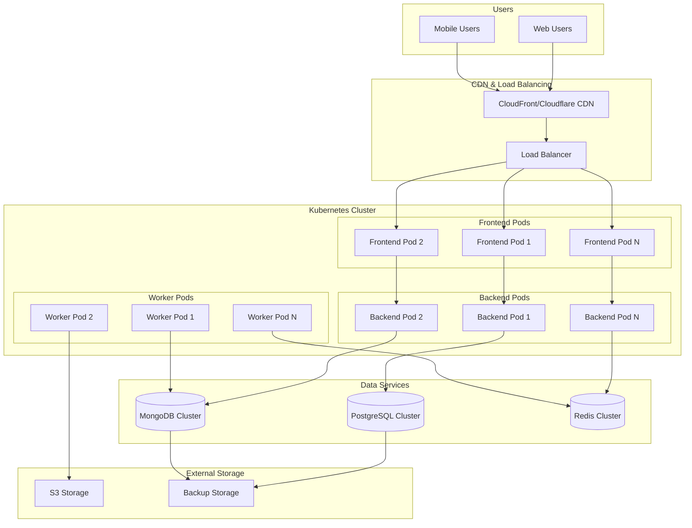

# Architecture Diagrams

## System Architecture Overview

This document provides detailed architectural diagrams showing the relationships and interactions between different components of the AI-Powered Multimedia Writing Platform.

## 1. High-Level System Architecture

## 2. Collaborative Editing Architecture

## 3. AI Integration Architecture

## 4. Multimedia Processing Pipeline

## 5. Document Export Pipeline

## 6. Data Flow Architecture

## 7. Security Architecture

## 8. Deployment Architecture

## Component Interaction Patterns

### Synchronous Communication
- Client ↔ API Gateway: REST/GraphQL over HTTPS
- API Gateway ↔ Services: Internal REST/gRPC
- Services ↔ Databases: Direct connections with connection pooling

### Asynchronous Communication
- Real-time updates: WebSocket connections
- Background jobs: Message queues (Redis/RabbitMQ)
- Event-driven: Pub/Sub patterns for service communication

### Data Consistency
- Strong consistency: PostgreSQL for critical user data
- Eventual consistency: MongoDB for document content
- CRDT-based: Collaborative editing state
- Cache invalidation: Redis with TTL and event-based invalidation

## Scalability Considerations

### Horizontal Scaling
- Stateless application services
- Load balancing across multiple instances
- Database read replicas
- Distributed caching

### Vertical Scaling
- Resource allocation based on service needs
- GPU instances for AI processing
- High-memory instances for large document processing

### Geographic Distribution
- Multi-region deployment
- CDN for static assets and media
- Database replication across regions
- Edge computing for low-latency operations

## Technology Choices Rationale

### Why CRDT for Collaboration?
- Conflict-free merging of concurrent edits
- Works offline with eventual consistency
- Proven in production (Figma, Notion)
- Libraries like Yjs provide robust implementation

### Why Microservices Architecture?
- Independent scaling of components
- Technology flexibility per service
- Fault isolation
- Easier maintenance and updates

### Why Multiple Databases?
- PostgreSQL: ACID compliance for user data
- MongoDB: Flexible schema for documents
- Redis: High-performance caching and real-time state
- Vector DB: Optimized for AI embeddings

### Why Kubernetes?
- Container orchestration at scale
- Self-healing and auto-scaling
- Rolling updates with zero downtime
- Cloud-agnostic deployment