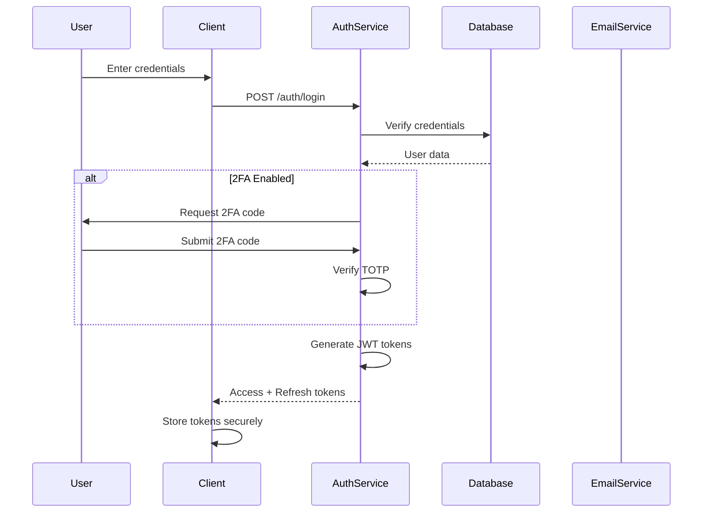
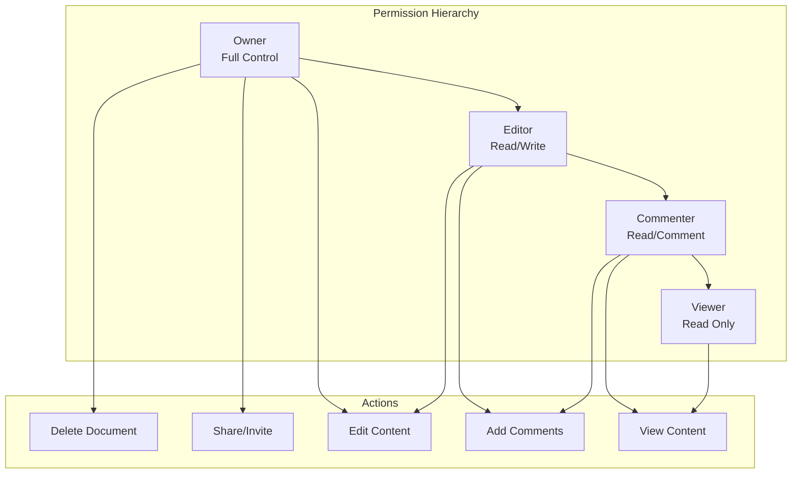
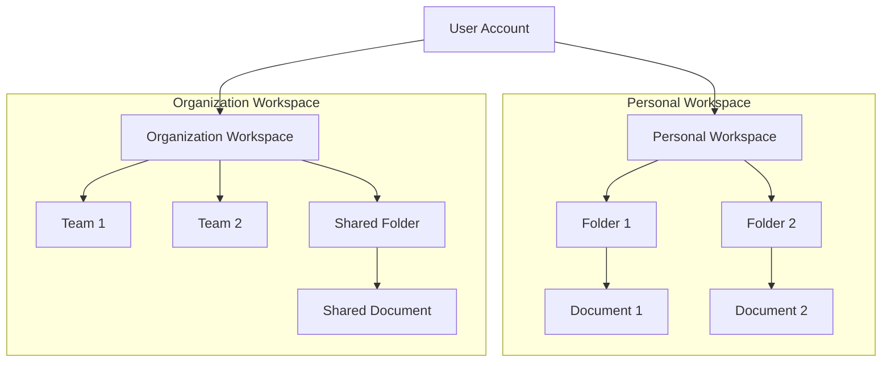
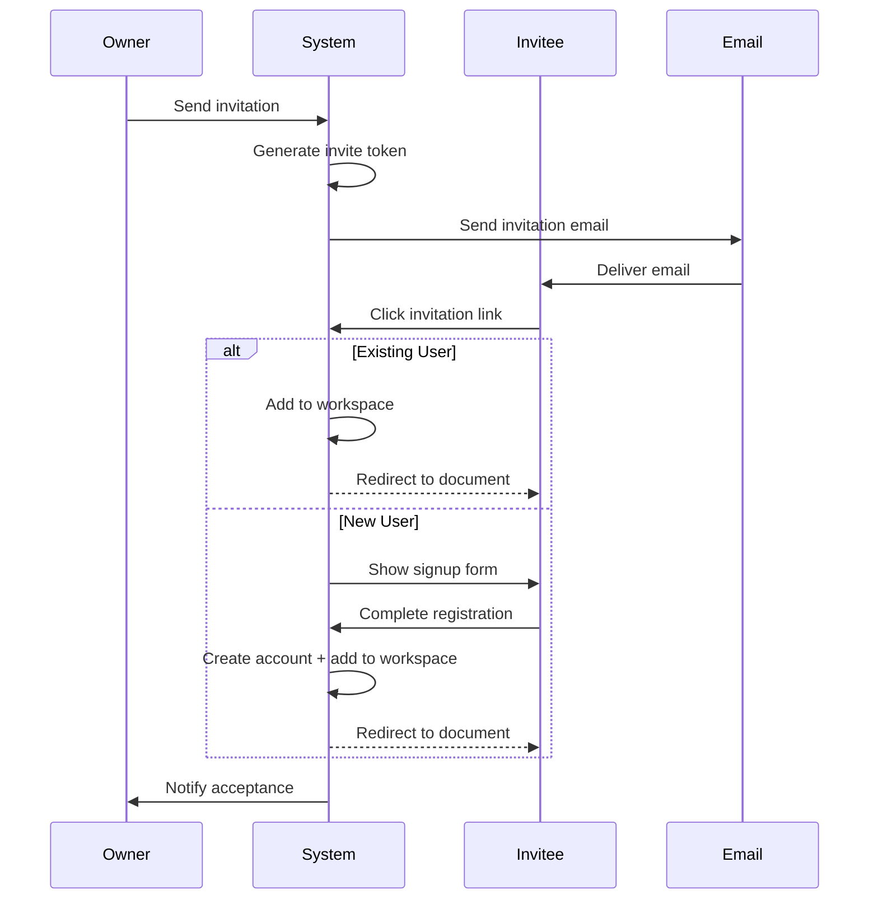

# User Management System Design

## Overview

The User Management System handles authentication, authorization, user profiles, workspace management, and team collaboration features. It serves as the foundation for secure access control and user experience personalization.

## Core Components

### 1. Authentication Service

#### Authentication Methods
- **Email/Password**: Traditional authentication with secure password hashing
- **OAuth 2.0**: Social login (Google, GitHub, Microsoft)
- **SSO/SAML**: Enterprise single sign-on for organizations
- **Magic Links**: Passwordless authentication via email
- **Two-Factor Authentication (2FA)**: TOTP-based additional security

#### Authentication Flow



#### Token Management
- **Access Token**: Short-lived (15 minutes), contains user claims
- **Refresh Token**: Long-lived (30 days), stored securely
- **Token Rotation**: Automatic refresh before expiration
- **Token Revocation**: Immediate invalidation on logout/security events

#### Security Features
- **Password Requirements**: Minimum 12 characters, complexity rules
- **Password Hashing**: Argon2id or bcrypt with salt
- **Rate Limiting**: Prevent brute force attacks
- **Account Lockout**: Temporary lock after failed attempts
- **Session Management**: Track active sessions, allow remote logout
- **IP Whitelisting**: Optional for enterprise accounts

### 2. Authorization Service

#### Role-Based Access Control (RBAC)

**System Roles:**
- **Super Admin**: Platform administration
- **Organization Admin**: Manage organization settings
- **Team Admin**: Manage team members and permissions
- **Editor**: Full read/write access to documents
- **Commenter**: Can view and comment
- **Viewer**: Read-only access

**Permission Model:**
```
User → Role → Permissions → Resources
```

#### Document-Level Permissions



#### Permission Inheritance
- Workspace permissions cascade to folders
- Folder permissions cascade to documents
- Explicit permissions override inherited ones
- Team permissions combine with individual permissions

### 3. User Profile Management

#### Profile Data Structure
```typescript
interface UserProfile {
  id: string;
  email: string;
  username: string;
  displayName: string;
  avatar: string;
  bio: string;
  
  // Preferences
  preferences: {
    language: string;
    timezone: string;
    theme: 'light' | 'dark' | 'auto';
    editorSettings: EditorPreferences;
    notificationSettings: NotificationPreferences;
  };
  
  // Metadata
  createdAt: Date;
  lastLoginAt: Date;
  emailVerified: boolean;
  twoFactorEnabled: boolean;
  
  // Subscription
  subscription: {
    plan: 'free' | 'pro' | 'team' | 'enterprise';
    status: 'active' | 'cancelled' | 'expired';
    expiresAt: Date;
  };
}
```

#### Profile Features
- **Avatar Management**: Upload, crop, or use Gravatar
- **Display Name**: Customizable display name
- **Bio**: Short description for collaboration
- **Preferences**: Editor settings, notifications, appearance
- **Privacy Settings**: Control visibility and data sharing
- **Connected Accounts**: Link OAuth providers

### 4. Workspace Management

#### Workspace Structure



#### Workspace Types
- **Personal Workspace**: Individual user's private space
- **Team Workspace**: Shared space for team collaboration
- **Organization Workspace**: Enterprise-level workspace with multiple teams

#### Workspace Features
- **Hierarchical Organization**: Folders and subfolders
- **Sharing Controls**: Granular permission management
- **Templates**: Reusable document templates
- **Trash/Archive**: Soft delete with recovery
- **Search**: Full-text search across workspace
- **Recent Items**: Quick access to recent documents

### 5. Team Collaboration

#### Team Structure
```typescript
interface Team {
  id: string;
  name: string;
  description: string;
  organizationId: string;
  
  members: TeamMember[];
  settings: TeamSettings;
  
  createdAt: Date;
  updatedAt: Date;
}

interface TeamMember {
  userId: string;
  role: 'admin' | 'member';
  joinedAt: Date;
  invitedBy: string;
}
```

#### Team Features
- **Member Management**: Add, remove, change roles
- **Team Permissions**: Default permissions for team members
- **Team Workspaces**: Shared document spaces
- **Activity Feed**: Team activity and updates
- **Team Settings**: Customizable team preferences

### 6. Invitation System

#### Invitation Flow



#### Invitation Types
- **Email Invitation**: Direct email to specific users
- **Link Sharing**: Shareable link with permissions
- **Public Link**: Anyone with link can access
- **Domain-Based**: Auto-join for specific email domains

#### Invitation Management
- **Expiration**: Time-limited invitations
- **Revocation**: Cancel pending invitations
- **Tracking**: Monitor invitation status
- **Limits**: Rate limiting to prevent abuse

## Data Models

### User Table (PostgreSQL)
```sql
CREATE TABLE users (
    id UUID PRIMARY KEY DEFAULT gen_random_uuid(),
    email VARCHAR(255) UNIQUE NOT NULL,
    username VARCHAR(50) UNIQUE NOT NULL,
    password_hash VARCHAR(255),
    display_name VARCHAR(100),
    avatar_url TEXT,
    bio TEXT,
    
    email_verified BOOLEAN DEFAULT FALSE,
    two_factor_enabled BOOLEAN DEFAULT FALSE,
    two_factor_secret VARCHAR(32),
    
    created_at TIMESTAMP DEFAULT NOW(),
    updated_at TIMESTAMP DEFAULT NOW(),
    last_login_at TIMESTAMP,
    
    subscription_plan VARCHAR(20) DEFAULT 'free',
    subscription_status VARCHAR(20) DEFAULT 'active',
    subscription_expires_at TIMESTAMP
);

CREATE INDEX idx_users_email ON users(email);
CREATE INDEX idx_users_username ON users(username);
```

### Workspace Table
```sql
CREATE TABLE workspaces (
    id UUID PRIMARY KEY DEFAULT gen_random_uuid(),
    name VARCHAR(100) NOT NULL,
    type VARCHAR(20) NOT NULL, -- 'personal', 'team', 'organization'
    owner_id UUID REFERENCES users(id),
    organization_id UUID REFERENCES organizations(id),
    
    settings JSONB,
    
    created_at TIMESTAMP DEFAULT NOW(),
    updated_at TIMESTAMP DEFAULT NOW()
);
```

### Permissions Table
```sql
CREATE TABLE permissions (
    id UUID PRIMARY KEY DEFAULT gen_random_uuid(),
    resource_type VARCHAR(20) NOT NULL, -- 'workspace', 'folder', 'document'
    resource_id UUID NOT NULL,
    user_id UUID REFERENCES users(id),
    team_id UUID REFERENCES teams(id),
    
    role VARCHAR(20) NOT NULL, -- 'owner', 'editor', 'commenter', 'viewer'
    
    granted_by UUID REFERENCES users(id),
    granted_at TIMESTAMP DEFAULT NOW(),
    
    CONSTRAINT check_user_or_team CHECK (
        (user_id IS NOT NULL AND team_id IS NULL) OR
        (user_id IS NULL AND team_id IS NOT NULL)
    )
);

CREATE INDEX idx_permissions_resource ON permissions(resource_type, resource_id);
CREATE INDEX idx_permissions_user ON permissions(user_id);
CREATE INDEX idx_permissions_team ON permissions(team_id);
```

## API Endpoints

### Authentication
```
POST   /api/auth/register          - Register new user
POST   /api/auth/login             - Login with credentials
POST   /api/auth/logout            - Logout current session
POST   /api/auth/refresh           - Refresh access token
POST   /api/auth/forgot-password   - Request password reset
POST   /api/auth/reset-password    - Reset password with token
POST   /api/auth/verify-email      - Verify email address
POST   /api/auth/2fa/enable        - Enable 2FA
POST   /api/auth/2fa/verify        - Verify 2FA code
```

### User Profile
```
GET    /api/users/me               - Get current user profile
PUT    /api/users/me               - Update profile
PUT    /api/users/me/avatar        - Upload avatar
GET    /api/users/:id              - Get user by ID (public info)
PUT    /api/users/me/preferences   - Update preferences
PUT    /api/users/me/password      - Change password
```

### Workspaces
```
GET    /api/workspaces             - List user's workspaces
POST   /api/workspaces             - Create workspace
GET    /api/workspaces/:id         - Get workspace details
PUT    /api/workspaces/:id         - Update workspace
DELETE /api/workspaces/:id         - Delete workspace
GET    /api/workspaces/:id/members - List workspace members
```

### Permissions
```
GET    /api/permissions/:resourceType/:resourceId  - Get permissions
POST   /api/permissions/:resourceType/:resourceId  - Grant permission
PUT    /api/permissions/:id                        - Update permission
DELETE /api/permissions/:id                        - Revoke permission
```

### Invitations
```
POST   /api/invitations            - Send invitation
GET    /api/invitations            - List pending invitations
GET    /api/invitations/:token     - Get invitation details
POST   /api/invitations/:token/accept - Accept invitation
DELETE /api/invitations/:id        - Cancel invitation
```

## Security Considerations

### Authentication Security
- **Password Storage**: Never store plain text passwords
- **Token Security**: Use httpOnly cookies for refresh tokens
- **CSRF Protection**: Implement CSRF tokens for state-changing operations
- **XSS Prevention**: Sanitize all user inputs
- **Session Hijacking**: Bind sessions to IP/User-Agent (optional)

### Authorization Security
- **Principle of Least Privilege**: Grant minimum necessary permissions
- **Permission Checks**: Verify permissions on every request
- **Resource Ownership**: Validate user owns/has access to resources
- **Audit Logging**: Log all permission changes

### Data Privacy
- **GDPR Compliance**: Right to access, delete, export data
- **Data Encryption**: Encrypt sensitive data at rest
- **PII Protection**: Minimize collection of personal information
- **Data Retention**: Implement data retention policies

## Performance Optimization

### Caching Strategy
- **User Sessions**: Cache in Redis (15-minute TTL)
- **Permissions**: Cache permission checks (5-minute TTL)
- **User Profiles**: Cache frequently accessed profiles
- **Workspace Metadata**: Cache workspace structure

### Database Optimization
- **Indexes**: Create indexes on frequently queried fields
- **Connection Pooling**: Reuse database connections
- **Query Optimization**: Use prepared statements
- **Pagination**: Implement cursor-based pagination

### Scalability
- **Stateless Services**: Enable horizontal scaling
- **Load Balancing**: Distribute requests across instances
- **Database Replication**: Read replicas for queries
- **Sharding**: Partition data by user/organization

## Monitoring & Analytics

### Key Metrics
- **Authentication Success Rate**: Track login success/failure
- **Active Users**: DAU/MAU metrics
- **Session Duration**: Average session length
- **Permission Changes**: Track permission modifications
- **Invitation Conversion**: Invitation acceptance rate

### Alerts
- **Failed Login Attempts**: Alert on suspicious activity
- **Account Lockouts**: Monitor locked accounts
- **Permission Escalation**: Alert on role changes
- **Unusual Access Patterns**: Detect anomalies

## Future Enhancements

### Planned Features
- **Social Features**: User profiles, following, activity feeds
- **Advanced SSO**: Support for more identity providers
- **Biometric Authentication**: Face ID, Touch ID support
- **Passwordless Authentication**: WebAuthn/FIDO2
- **Advanced Analytics**: User behavior analytics
- **Compliance Tools**: HIPAA, SOC 2 compliance features