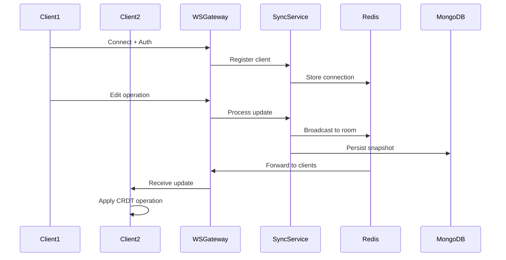
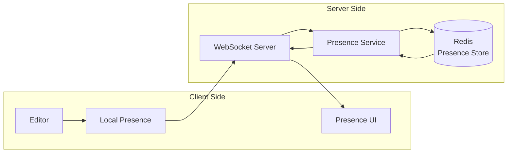
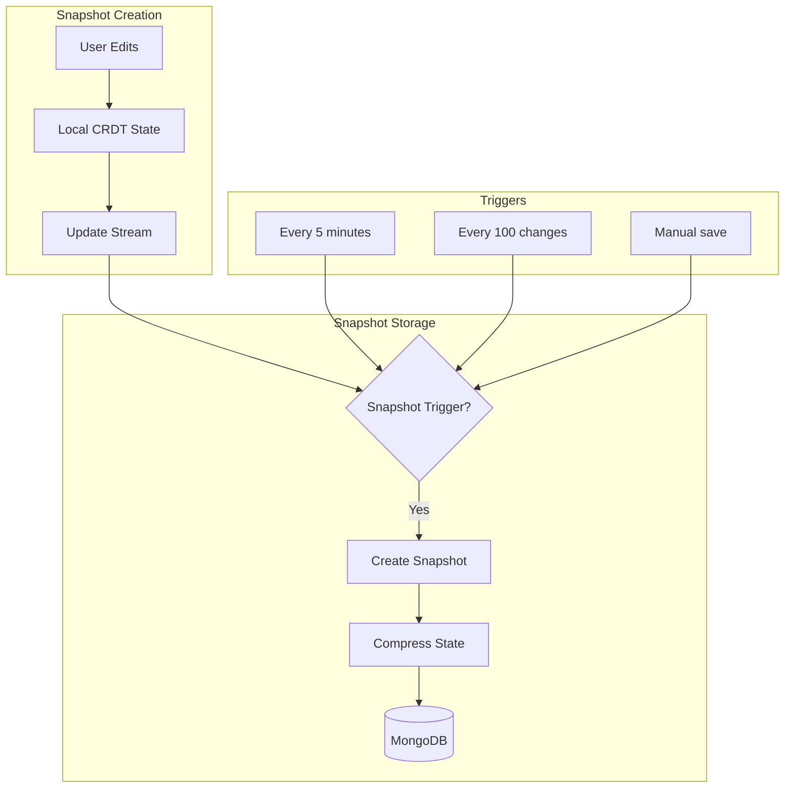
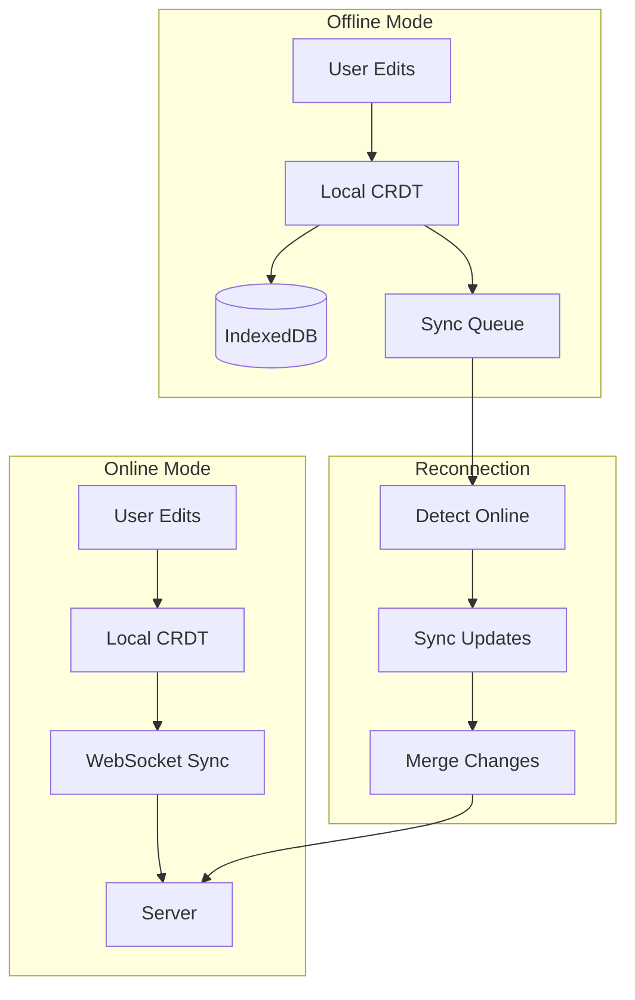
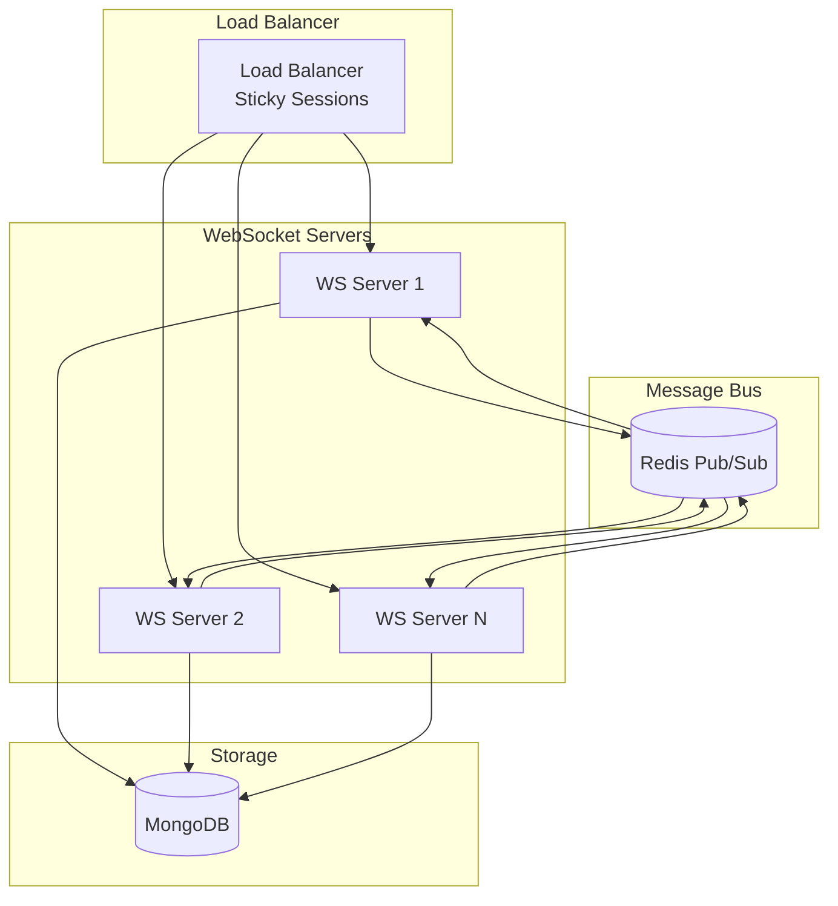

# Collaborative Editing System Design

## Overview

The Collaborative Editing System enables real-time, conflict-free editing of documents by multiple users simultaneously. It leverages Conflict-free Replicated Data Types (CRDTs) to ensure consistency across all clients without requiring a central lock mechanism.

## Core Concepts

### Real-Time Collaboration Requirements
- **Low Latency**: Changes appear within 100ms
- **Conflict-Free**: Automatic merge of concurrent edits
- **Offline Support**: Continue editing without connection
- **Presence Awareness**: See who's editing what
- **Cursor Tracking**: View other users' cursor positions
- **Undo/Redo**: Per-user operation history

## Architecture Components

### 1. CRDT Implementation

#### Why CRDT?
- **Eventual Consistency**: All clients converge to same state
- **No Central Coordination**: Decentralized conflict resolution
- **Offline-First**: Works without network connection
- **Commutative Operations**: Order-independent merging

#### CRDT Library Choice: Yjs

**Advantages:**
- Mature, battle-tested library
- Excellent performance (optimized for text editing)
- Rich ecosystem (y-websocket, y-indexeddb, y-protocols)
- TypeScript support
- Small bundle size
- Active community

**Core Data Structures:**
```typescript
import * as Y from 'yjs';

// Document structure
const ydoc = new Y.Doc();

// Text content (main editor)
const ytext = ydoc.getText('content');

// Document metadata
const ymeta = ydoc.getMap('metadata');

// Comments
const ycomments = ydoc.getArray('comments');

// Presence (cursor positions, selections)
const awareness = new awarenessProtocol.Awareness(ydoc);
```

### 2. Real-Time Synchronization

#### WebSocket Architecture



#### Synchronization Protocol

**Connection Establishment:**
```typescript
// Client connects to document
const provider = new WebsocketProvider(
  'wss://api.example.com/sync',
  documentId,
  ydoc,
  {
    params: { token: authToken }
  }
);

// Sync state
provider.on('status', event => {
  console.log(event.status); // 'connecting' | 'connected' | 'disconnected'
});

// Sync complete
provider.on('sync', isSynced => {
  console.log('Document synced:', isSynced);
});
```

**Update Protocol:**
1. Client makes local edit
2. CRDT generates update message
3. Update sent via WebSocket
4. Server broadcasts to all connected clients
5. Clients apply update to their local CRDT
6. Server persists snapshot periodically

### 3. Presence System

#### Presence Information

```typescript
interface UserPresence {
  user: {
    id: string;
    name: string;
    avatar: string;
    color: string; // Unique color for cursor/selection
  };
  cursor: {
    position: number;
    anchor: number;
    head: number;
  } | null;
  selection: {
    from: number;
    to: number;
  } | null;
  lastActivity: number;
  status: 'active' | 'idle' | 'away';
}
```

#### Presence Updates



**Implementation:**
```typescript
// Update presence on cursor move
awareness.setLocalStateField('cursor', {
  position: editor.state.selection.from,
  anchor: editor.state.selection.anchor,
  head: editor.state.selection.head
});

// Listen to presence changes
awareness.on('change', changes => {
  changes.added.forEach(clientId => {
    const state = awareness.getStates().get(clientId);
    renderUserCursor(state);
  });
  
  changes.updated.forEach(clientId => {
    const state = awareness.getStates().get(clientId);
    updateUserCursor(state);
  });
  
  changes.removed.forEach(clientId => {
    removeUserCursor(clientId);
  });
});
```

### 4. Conflict Resolution

#### Automatic Conflict Resolution

**Text Editing Conflicts:**
```
Initial: "Hello World"

User A: Insert "Beautiful " at position 6
Result: "Hello Beautiful World"

User B: Insert "Amazing " at position 6 (concurrent)
Result: "Hello Amazing World"

CRDT Merge: "Hello Beautiful Amazing World"
```

**Conflict Resolution Rules:**
- **Concurrent Inserts**: Both preserved, ordered by client ID
- **Concurrent Deletes**: Tombstone markers prevent resurrection
- **Insert + Delete**: Delete wins if overlapping
- **Formatting Conflicts**: Last-write-wins with timestamp

#### Manual Conflict Resolution

For complex conflicts (rare):
```typescript
interface Conflict {
  id: string;
  type: 'content' | 'formatting' | 'structure';
  position: number;
  operations: ConflictingOperation[];
  timestamp: number;
}

interface ConflictingOperation {
  userId: string;
  operation: Y.Update;
  preview: string;
}
```

### 5. Version History

#### Snapshot Strategy



**Snapshot Structure:**
```typescript
interface DocumentSnapshot {
  id: string;
  documentId: string;
  version: number;
  
  // CRDT state
  state: Uint8Array; // Compressed Y.Doc state
  
  // Metadata
  createdBy: string;
  createdAt: Date;
  changeCount: number;
  
  // Optional: Human-readable preview
  preview?: {
    text: string;
    length: number;
  };
}
```

#### Version History UI

```typescript
interface VersionHistoryEntry {
  version: number;
  timestamp: Date;
  author: {
    id: string;
    name: string;
    avatar: string;
  };
  changes: {
    additions: number;
    deletions: number;
    summary: string;
  };
  snapshot: boolean; // Is this a stored snapshot?
}
```

### 6. Offline Support

#### Offline-First Architecture



**Implementation:**
```typescript
// Persist to IndexedDB
const indexeddbProvider = new IndexeddbPersistence(
  documentId,
  ydoc
);

// Sync when online
indexeddbProvider.on('synced', () => {
  console.log('Local persistence synced');
});

// Handle offline/online transitions
window.addEventListener('online', () => {
  provider.connect();
  syncQueuedUpdates();
});

window.addEventListener('offline', () => {
  provider.disconnect();
  enableOfflineMode();
});
```

### 7. Performance Optimization

#### Update Batching

```typescript
// Batch updates to reduce network traffic
const updateBatcher = {
  updates: [],
  timeout: null,
  
  add(update: Uint8Array) {
    this.updates.push(update);
    
    if (!this.timeout) {
      this.timeout = setTimeout(() => {
        this.flush();
      }, 50); // 50ms batching window
    }
  },
  
  flush() {
    if (this.updates.length > 0) {
      const merged = Y.mergeUpdates(this.updates);
      provider.send(merged);
      this.updates = [];
    }
    this.timeout = null;
  }
};
```

#### Delta Compression

```typescript
// Only send changes, not full document
const stateVector = Y.encodeStateVector(ydoc);
const diff = Y.encodeStateAsUpdate(ydoc, stateVector);

// Compress before sending
const compressed = pako.deflate(diff);
```

#### Lazy Loading

```typescript
// Load document in chunks for large documents
async function loadDocument(documentId: string) {
  // Load metadata first
  const metadata = await fetchMetadata(documentId);
  
  // Load initial viewport content
  const initialContent = await fetchContent(documentId, {
    from: 0,
    to: 10000 // First 10k characters
  });
  
  // Load rest in background
  loadRemainingContent(documentId, 10000);
}
```

## Data Models

### Document State (MongoDB)

```typescript
interface DocumentState {
  _id: string;
  documentId: string;
  
  // Current CRDT state
  state: Buffer; // Y.Doc encoded state
  stateVector: Buffer; // For delta sync
  
  // Metadata
  version: number;
  lastModified: Date;
  lastModifiedBy: string;
  
  // Snapshots
  snapshots: {
    version: number;
    state: Buffer;
    createdAt: Date;
    createdBy: string;
  }[];
  
  // Statistics
  stats: {
    totalEdits: number;
    activeUsers: number;
    lastActivity: Date;
  };
}
```

### Active Sessions (Redis)

```typescript
interface ActiveSession {
  sessionId: string;
  documentId: string;
  userId: string;
  
  // Connection info
  connectionId: string;
  connectedAt: number;
  lastActivity: number;
  
  // Presence
  presence: UserPresence;
  
  // TTL: 5 minutes (auto-expire)
}
```

## API Endpoints

### WebSocket Events

**Client → Server:**
```typescript
// Join document
{
  type: 'join',
  documentId: string,
  token: string
}

// Send update
{
  type: 'update',
  update: Uint8Array
}

// Update presence
{
  type: 'presence',
  presence: UserPresence
}

// Request snapshot
{
  type: 'snapshot',
  version?: number
}
```

**Server → Client:**
```typescript
// Sync state
{
  type: 'sync',
  state: Uint8Array,
  stateVector: Uint8Array
}

// Broadcast update
{
  type: 'update',
  update: Uint8Array,
  origin: string
}

// Presence update
{
  type: 'presence',
  users: Map<string, UserPresence>
}

// Error
{
  type: 'error',
  message: string,
  code: string
}
```

### REST API

```
GET    /api/documents/:id/state        - Get current document state
POST   /api/documents/:id/snapshot     - Create manual snapshot
GET    /api/documents/:id/versions     - List version history
GET    /api/documents/:id/versions/:v  - Get specific version
POST   /api/documents/:id/restore/:v   - Restore to version
GET    /api/documents/:id/sessions     - List active sessions
```

## Scalability Considerations

### Horizontal Scaling



**Scaling Strategy:**
- **Sticky Sessions**: Route user to same server when possible
- **Redis Pub/Sub**: Broadcast updates across servers
- **Document Sharding**: Distribute documents across servers
- **Read Replicas**: Scale read operations

### Performance Targets

| Metric | Target | Notes |
|--------|--------|-------|
| Sync Latency | < 100ms | P95 |
| Connection Time | < 500ms | Initial sync |
| Memory per Document | < 10MB | Active state |
| Concurrent Users per Document | 50+ | Typical use case |
| Updates per Second | 1000+ | Per document |
| Snapshot Creation | < 1s | Background process |

## Security Considerations

### Access Control
- **Document-Level Permissions**: Verify on connection
- **Operation Validation**: Validate all CRDT operations
- **Rate Limiting**: Prevent spam/abuse
- **Session Timeout**: Auto-disconnect idle sessions

### Data Integrity
- **Checksum Verification**: Validate update integrity
- **State Validation**: Verify CRDT state consistency
- **Audit Logging**: Log all document modifications
- **Backup Strategy**: Regular snapshot backups

## Monitoring & Debugging

### Key Metrics
- **Active Connections**: Real-time connection count
- **Sync Latency**: Time from edit to broadcast
- **Update Rate**: Operations per second
- **Conflict Rate**: Concurrent edit conflicts
- **Error Rate**: Failed operations
- **Memory Usage**: Per-document memory consumption

### Debugging Tools
- **State Inspector**: View CRDT state
- **Update Log**: Trace operation history
- **Conflict Visualizer**: Show conflict resolution
- **Performance Profiler**: Identify bottlenecks

## Testing Strategy

### Unit Tests
- CRDT operation correctness
- Conflict resolution logic
- Presence tracking
- Snapshot creation/restoration

### Integration Tests
- Multi-client synchronization
- Offline/online transitions
- Network failure recovery
- Large document handling

### Load Tests
- Concurrent user simulation
- High-frequency updates
- Memory leak detection
- Scalability validation

## Future Enhancements

### Planned Features
- **Rich Text Formatting**: Bold, italic, lists, etc.
- **Block-Based Editing**: Notion-style blocks
- **Real-Time Voice/Video**: Integrated communication
- **AI-Powered Suggestions**: Collaborative AI assistance
- **Advanced Undo/Redo**: Branch-based history
- **Conflict Visualization**: Show merge decisions
- **Performance Analytics**: Per-user metrics
- **Mobile Optimization**: Touch-friendly editing