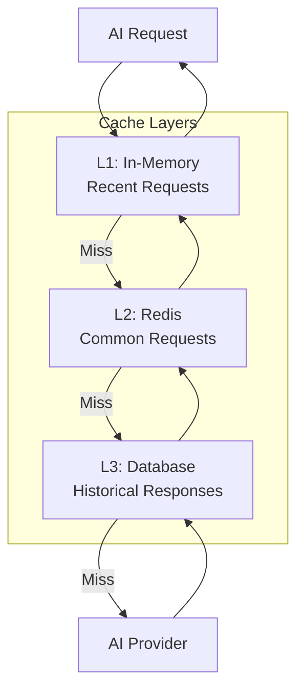

# AI Integration System Design

## Overview

The AI Integration System provides intelligent writing assistance, content generation, research support, and multimedia enhancement capabilities. It leverages Large Language Models (LLMs) and other AI services to augment the writing experience.

## Core AI Capabilities

### 1. Content Generation
- **Text Generation**: Create content from prompts
- **Continuation**: Complete partial sentences/paragraphs
- **Expansion**: Elaborate on brief points
- **Outline Generation**: Create document structure
- **Section Writing**: Generate specific sections

### 2. Content Enhancement
- **Grammar & Spelling**: Correct errors
- **Style Improvement**: Enhance clarity and flow
- **Tone Adjustment**: Formal, casual, academic, etc.
- **Simplification**: Make complex text accessible
- **Paraphrasing**: Rewrite while preserving meaning

### 3. Research Assistance
- **Summarization**: Condense long texts
- **Citation Generation**: Create proper citations
- **Fact Checking**: Verify claims (with sources)
- **Related Content**: Find relevant information
- **Question Answering**: Answer questions about content

### 4. Multimedia AI
- **Image Analysis**: Generate alt-text, captions
- **Audio Transcription**: Convert speech to text
- **Video Analysis**: Extract key frames, generate summaries
- **Content Moderation**: Flag inappropriate content

## Architecture

### High-Level AI Architecture

```mermaid
graph TB
    subgraph "User Interface"
        Editor[Document Editor]
        AIPanel[AI Assistant Panel]
        ContextMenu[Context Menu]
    end
    
    subgraph "AI Service Layer"
        AIOrchestrator[AI Orchestrator]
        PromptEngine[Prompt Engineering]
        ContextBuilder[Context Builder]
        ResponseProcessor[Response Processor]
        CostOptimizer[Cost Optimizer]
    end
    
    subgraph "AI Providers"
        OpenAI[OpenAI GPT-4]
        Claude[Anthropic Claude]
        LocalLLM[Local LLM<br/>Llama/Mistral]
        Specialized[Specialized Models<br/>Grammar, etc.]
    end
    
    subgraph "Supporting Services"
        Cache[(Response Cache<br/>Redis)]
        Queue[Job Queue<br/>Bull/Celery)]
        VectorDB[(Vector Store<br/>Pinecone)]
        Analytics[Usage Analytics]
    end
    
    Editor --> AIOrchestrator
    AIPanel --> AIOrchestrator
    ContextMenu --> AIOrchestrator
    
    AIOrchestrator --> PromptEngine
    AIOrchestrator --> ContextBuilder
    AIOrchestrator --> CostOptimizer
    
    PromptEngine --> Cache
    Cache -->|Miss| Queue
    
    Queue --> OpenAI
    Queue --> Claude
    Queue --> LocalLLM
    Queue --> Specialized
    
    OpenAI --> ResponseProcessor
    Claude --> ResponseProcessor
    LocalLLM --> ResponseProcessor
    
    ResponseProcessor --> Cache
    ResponseProcessor --> Analytics
    
    ContextBuilder --> VectorDB
```

## AI Service Components

### 1. AI Orchestrator

**Responsibilities:**
- Route requests to appropriate AI provider
- Manage request prioritization
- Handle fallback strategies
- Track usage and costs
- Implement rate limiting

```typescript
interface AIRequest {
  type: 'generate' | 'edit' | 'analyze' | 'research';
  prompt: string;
  context?: DocumentContext;
  options: {
    model?: string;
    temperature?: number;
    maxTokens?: number;
    stream?: boolean;
  };
  userId: string;
  documentId: string;
}

interface AIResponse {
  id: string;
  content: string;
  model: string;
  usage: {
    promptTokens: number;
    completionTokens: number;
    totalTokens: number;
  };
  metadata: {
    latency: number;
    cached: boolean;
    cost: number;
  };
}

class AIOrchestrator {
  async process(request: AIRequest): Promise<AIResponse> {
    // 1. Check cache
    const cached = await this.checkCache(request);
    if (cached) return cached;
    
    // 2. Select provider
    const provider = await this.selectProvider(request);
    
    // 3. Build prompt
    const prompt = await this.buildPrompt(request);
    
    // 4. Execute request
    const response = await provider.execute(prompt);
    
    // 5. Process response
    const processed = await this.processResponse(response);
    
    // 6. Cache result
    await this.cacheResponse(request, processed);
    
    // 7. Track usage
    await this.trackUsage(request, processed);
    
    return processed;
  }
}
```

### 2. Prompt Engineering

**Prompt Templates:**

```typescript
interface PromptTemplate {
  id: string;
  name: string;
  description: string;
  template: string;
  variables: string[];
  examples?: PromptExample[];
}

const PROMPT_TEMPLATES = {
  textGeneration: {
    id: 'text-generation',
    name: 'Text Generation',
    template: `
You are a professional writer helping to create content.

Context: {{context}}
Topic: {{topic}}
Style: {{style}}
Length: {{length}}

Generate high-quality content that:
- Matches the specified style and tone
- Is well-structured and coherent
- Includes relevant details and examples
- Maintains consistency with the context

Content:`,
    variables: ['context', 'topic', 'style', 'length']
  },
  
  grammarCorrection: {
    id: 'grammar-correction',
    name: 'Grammar Correction',
    template: `
Correct the grammar and spelling in the following text while preserving the original meaning and style.

Original text:
{{text}}

Corrected text:`,
    variables: ['text']
  },
  
  summarization: {
    id: 'summarization',
    name: 'Summarization',
    template: `
Summarize the following text in {{length}} words or less. Focus on the main points and key takeaways.

Text:
{{text}}

Summary:`,
    variables: ['text', 'length']
  },
  
  researchAssistant: {
    id: 'research-assistant',
    name: 'Research Assistant',
    template: `
You are a research assistant helping to find and synthesize information.

Question: {{question}}
Context: {{context}}

Provide a comprehensive answer that:
- Addresses the question directly
- Includes relevant facts and details
- Cites sources when possible
- Is accurate and well-researched

Answer:`,
    variables: ['question', 'context']
  }
};
```

**Dynamic Prompt Building:**

```typescript
class PromptEngine {
  buildPrompt(request: AIRequest): string {
    const template = this.getTemplate(request.type);
    const context = this.buildContext(request);
    const variables = this.extractVariables(request);
    
    return this.interpolate(template, {
      ...variables,
      context
    });
  }
  
  buildContext(request: AIRequest): string {
    const parts: string[] = [];
    
    // Document context
    if (request.context?.documentType) {
      parts.push(`Document type: ${request.context.documentType}`);
    }
    
    // Surrounding text
    if (request.context?.before) {
      parts.push(`Previous text: ${request.context.before}`);
    }
    
    // User preferences
    if (request.context?.preferences) {
      parts.push(`Style preferences: ${JSON.stringify(request.context.preferences)}`);
    }
    
    return parts.join('\n');
  }
}
```

### 3. Context Builder

**Document Context:**

```typescript
interface DocumentContext {
  // Document metadata
  documentType: 'paper' | 'book' | 'novel' | 'report' | 'article';
  title?: string;
  author?: string;
  
  // Content context
  before?: string; // Text before cursor
  after?: string;  // Text after cursor
  selection?: string; // Selected text
  
  // Structural context
  section?: string; // Current section
  outline?: string[]; // Document outline
  
  // User preferences
  preferences?: {
    style: string;
    tone: string;
    audience: string;
  };
  
  // Related content
  relatedDocuments?: string[];
  citations?: Citation[];
}

class ContextBuilder {
  async buildContext(
    documentId: string,
    cursorPosition: number,
    options: ContextOptions
  ): Promise<DocumentContext> {
    const document = await this.getDocument(documentId);
    
    // Extract surrounding text
    const before = this.extractBefore(document, cursorPosition, 500);
    const after = this.extractAfter(document, cursorPosition, 500);
    
    // Get document structure
    const outline = await this.extractOutline(document);
    const section = this.getCurrentSection(document, cursorPosition);
    
    // Get user preferences
    const preferences = await this.getUserPreferences(document.userId);
    
    // Find related content using vector search
    const relatedDocuments = await this.findRelatedDocuments(
      document,
      options.includeRelated
    );
    
    return {
      documentType: document.type,
      title: document.title,
      before,
      after,
      section,
      outline,
      preferences,
      relatedDocuments
    };
  }
  
  async findRelatedDocuments(
    document: Document,
    limit: number = 5
  ): Promise<string[]> {
    // Generate embedding for current document
    const embedding = await this.generateEmbedding(document.content);
    
    // Search vector database
    const results = await vectorDB.search(embedding, {
      limit,
      filter: { userId: document.userId }
    });
    
    return results.map(r => r.documentId);
  }
}
```

### 4. Response Processing

```typescript
class ResponseProcessor {
  async process(
    response: RawAIResponse,
    request: AIRequest
  ): Promise<AIResponse> {
    // 1. Extract content
    let content = this.extractContent(response);
    
    // 2. Post-process based on request type
    switch (request.type) {
      case 'generate':
        content = this.cleanGeneratedText(content);
        break;
      case 'edit':
        content = this.validateEdits(content, request.context);
        break;
      case 'analyze':
        content = this.structureAnalysis(content);
        break;
    }
    
    // 3. Calculate usage
    const usage = this.calculateUsage(response);
    
    // 4. Add metadata
    const metadata = {
      latency: response.latency,
      cached: false,
      cost: this.calculateCost(usage, response.model)
    };
    
    return {
      id: generateId(),
      content,
      model: response.model,
      usage,
      metadata
    };
  }
  
  cleanGeneratedText(text: string): string {
    // Remove common artifacts
    text = text.trim();
    text = this.removeMarkdownArtifacts(text);
    text = this.fixFormatting(text);
    return text;
  }
}
```

## AI Features Implementation

### 1. Text Generation

```typescript
interface GenerationRequest {
  prompt: string;
  context: DocumentContext;
  options: {
    length: 'short' | 'medium' | 'long';
    style: 'formal' | 'casual' | 'academic' | 'creative';
    tone: 'professional' | 'friendly' | 'persuasive';
  };
}

async function generateText(request: GenerationRequest): Promise<string> {
  const aiRequest: AIRequest = {
    type: 'generate',
    prompt: request.prompt,
    context: request.context,
    options: {
      model: 'gpt-4',
      temperature: 0.7,
      maxTokens: getLengthTokens(request.options.length)
    },
    userId: request.context.userId,
    documentId: request.context.documentId
  };
  
  const response = await aiOrchestrator.process(aiRequest);
  return response.content;
}
```

### 2. Grammar & Style Correction

```typescript
interface CorrectionRequest {
  text: string;
  options: {
    fixGrammar: boolean;
    fixSpelling: boolean;
    improveStyle: boolean;
    preserveTone: boolean;
  };
}

async function correctText(request: CorrectionRequest): Promise<{
  correctedText: string;
  changes: TextChange[];
}> {
  // Use specialized grammar model for better accuracy
  const response = await aiOrchestrator.process({
    type: 'edit',
    prompt: buildCorrectionPrompt(request),
    options: {
      model: 'gpt-4',
      temperature: 0.3 // Lower temperature for corrections
    }
  });
  
  // Parse changes
  const changes = parseTextChanges(request.text, response.content);
  
  return {
    correctedText: response.content,
    changes
  };
}

interface TextChange {
  type: 'grammar' | 'spelling' | 'style';
  original: string;
  corrected: string;
  position: { start: number; end: number };
  explanation: string;
}
```

### 3. Research Assistant

```typescript
interface ResearchRequest {
  question: string;
  context: DocumentContext;
  options: {
    includeSources: boolean;
    depth: 'quick' | 'detailed' | 'comprehensive';
  };
}

async function researchAssistant(
  request: ResearchRequest
): Promise<ResearchResponse> {
  // 1. Search vector database for relevant content
  const relevantDocs = await searchRelevantContent(request.question);
  
  // 2. Build context with relevant information
  const enrichedContext = {
    ...request.context,
    relatedContent: relevantDocs
  };
  
  // 3. Generate answer
  const response = await aiOrchestrator.process({
    type: 'research',
    prompt: request.question,
    context: enrichedContext,
    options: {
      model: 'gpt-4',
      temperature: 0.5
    }
  });
  
  // 4. Extract citations if requested
  const citations = request.options.includeSources
    ? await extractCitations(response.content)
    : [];
  
  return {
    answer: response.content,
    citations,
    relatedDocuments: relevantDocs.map(d => d.id)
  };
}

interface ResearchResponse {
  answer: string;
  citations: Citation[];
  relatedDocuments: string[];
}
```

### 4. Multimedia AI

```typescript
// Image Analysis
async function analyzeImage(imageUrl: string): Promise<ImageAnalysis> {
  const response = await openai.chat.completions.create({
    model: 'gpt-4-vision-preview',
    messages: [{
      role: 'user',
      content: [
        { type: 'text', text: 'Analyze this image and provide a detailed description, suitable alt-text, and suggested caption.' },
        { type: 'image_url', image_url: { url: imageUrl } }
      ]
    }]
  });
  
  return parseImageAnalysis(response.choices[0].message.content);
}

interface ImageAnalysis {
  description: string;
  altText: string;
  suggestedCaption: string;
  tags: string[];
  detectedObjects: string[];
}

// Audio Transcription
async function transcribeAudio(audioUrl: string): Promise<Transcription> {
  const response = await openai.audio.transcriptions.create({
    file: await fetchAudioFile(audioUrl),
    model: 'whisper-1',
    response_format: 'verbose_json',
    timestamp_granularities: ['word']
  });
  
  return {
    text: response.text,
    words: response.words,
    duration: response.duration,
    language: response.language
  };
}
```

## Caching Strategy

### Multi-Level Caching



**Cache Implementation:**

```typescript
class AICache {
  private memoryCache: LRUCache<string, AIResponse>;
  private redisCache: Redis;
  
  async get(request: AIRequest): Promise<AIResponse | null> {
    // Generate cache key
    const key = this.generateCacheKey(request);
    
    // L1: Memory cache
    const memCached = this.memoryCache.get(key);
    if (memCached) {
      return { ...memCached, metadata: { ...memCached.metadata, cached: true } };
    }
    
    // L2: Redis cache
    const redisCached = await this.redisCache.get(key);
    if (redisCached) {
      const response = JSON.parse(redisCached);
      this.memoryCache.set(key, response);
      return { ...response, metadata: { ...response.metadata, cached: true } };
    }
    
    return null;
  }
  
  async set(request: AIRequest, response: AIResponse): Promise<void> {
    const key = this.generateCacheKey(request);
    const ttl = this.calculateTTL(request);
    
    // Store in both caches
    this.memoryCache.set(key, response);
    await this.redisCache.setex(key, ttl, JSON.stringify(response));
  }
  
  private generateCacheKey(request: AIRequest): string {
    // Create deterministic key from request
    const normalized = {
      type: request.type,
      prompt: request.prompt.trim().toLowerCase(),
      model: request.options.model,
      // Exclude user-specific data for better cache hits
    };
    
    return crypto
      .createHash('sha256')
      .update(JSON.stringify(normalized))
      .digest('hex');
  }
  
  private calculateTTL(request: AIRequest): number {
    // Different TTLs based on request type
    const ttls = {
      generate: 3600,      // 1 hour
      edit: 7200,          // 2 hours
      analyze: 86400,      // 24 hours
      research: 43200      // 12 hours
    };
    
    return ttls[request.type] || 3600;
  }
}
```

## Cost Optimization

### Token Management

```typescript
class CostOptimizer {
  async optimizeRequest(request: AIRequest): Promise<AIRequest> {
    // 1. Truncate context if too long
    if (request.context) {
      request.context = await this.truncateContext(
        request.context,
        request.options.maxTokens
      );
    }
    
    // 2. Select appropriate model
    request.options.model = this.selectModel(request);
    
    // 3. Adjust parameters
    request.options = this.optimizeParameters(request.options);
    
    return request;
  }
  
  selectModel(request: AIRequest): string {
    // Use cheaper models for simple tasks
    if (request.type === 'edit' && this.isSimpleEdit(request)) {
      return 'gpt-3.5-turbo';
    }
    
    // Use more capable models for complex tasks
    if (request.type === 'research' || this.requiresReasoning(request)) {
      return 'gpt-4';
    }
    
    return 'gpt-3.5-turbo'; // Default
  }
  
  async estimateCost(request: AIRequest): Promise<number> {
    const promptTokens = await this.countTokens(request.prompt);
    const maxCompletionTokens = request.options.maxTokens || 1000;
    
    const pricing = this.getModelPricing(request.options.model);
    
    return (
      (promptTokens * pricing.input) +
      (maxCompletionTokens * pricing.output)
    );
  }
}
```

### Usage Tracking

```typescript
interface UsageRecord {
  userId: string;
  documentId: string;
  requestType: string;
  model: string;
  promptTokens: number;
  completionTokens: number;
  totalTokens: number;
  cost: number;
  latency: number;
  cached: boolean;
  timestamp: Date;
}

class UsageTracker {
  async track(request: AIRequest, response: AIResponse): Promise<void> {
    const record: UsageRecord = {
      userId: request.userId,
      documentId: request.documentId,
      requestType: request.type,
      model: response.model,
      promptTokens: response.usage.promptTokens,
      completionTokens: response.usage.completionTokens,
      totalTokens: response.usage.totalTokens,
      cost: response.metadata.cost,
      latency: response.metadata.latency,
      cached: response.metadata.cached,
      timestamp: new Date()
    };
    
    // Store in database
    await db.usageRecords.insert(record);
    
    // Update user quota
    await this.updateUserQuota(request.userId, record);
    
    // Send to analytics
    await analytics.track('ai_request', record);
  }
  
  async getUserUsage(
    userId: string,
    period: 'day' | 'month'
  ): Promise<UsageStats> {
    const startDate = this.getStartDate(period);
    
    const records = await db.usageRecords.find({
      userId,
      timestamp: { $gte: startDate }
    });
    
    return {
      totalRequests: records.length,
      totalTokens: records.reduce((sum, r) => sum + r.totalTokens, 0),
      totalCost: records.reduce((sum, r) => sum + r.cost, 0),
      cacheHitRate: records.filter(r => r.cached).length / records.length,
      averageLatency: records.reduce((sum, r) => sum + r.latency, 0) / records.length
    };
  }
}
```

## Rate Limiting & Quotas

```typescript
interface UserQuota {
  userId: string;
  plan: 'free' | 'pro' | 'team' | 'enterprise';
  limits: {
    requestsPerDay: number;
    tokensPerMonth: number;
    costPerMonth: number;
  };
  usage: {
    requestsToday: number;
    tokensThisMonth: number;
    costThisMonth: number;
  };
  resetDates: {
    daily: Date;
    monthly: Date;
  };
}

class RateLimiter {
  async checkQuota(userId: string): Promise<QuotaStatus> {
    const quota = await this.getUserQuota(userId);
    
    // Check daily request limit
    if (quota.usage.requestsToday >= quota.limits.requestsPerDay) {
      return {
        allowed: false,
        reason: 'daily_request_limit',
        resetAt: quota.resetDates.daily
      };
    }
    
    // Check monthly token limit
    if (quota.usage.tokensThisMonth >= quota.limits.tokensPerMonth) {
      return {
        allowed: false,
        reason: 'monthly_token_limit',
        resetAt: quota.resetDates.monthly
      };
    }
    
    // Check monthly cost limit
    if (quota.usage.costThisMonth >= quota.limits.costPerMonth) {
      return {
        allowed: false,
        reason: 'monthly_cost_limit',
        resetAt: quota.resetDates.monthly
      };
    }
    
    return { allowed: true };
  }
}
```

## API Endpoints

```
POST   /api/ai/generate           - Generate text
POST   /api/ai/edit                - Edit/improve text
POST   /api/ai/analyze             - Analyze content
POST   /api/ai/research            - Research assistant
POST   /api/ai/summarize           - Summarize text
POST   /api/ai/translate           - Translate text
POST   /api/ai/image/analyze       - Analyze image
POST   /api/ai/audio/transcribe    - Transcribe audio
GET    /api/ai/usage               - Get usage statistics
GET    /api/ai/quota               - Get quota status
```

## Security & Privacy

### Data Privacy
- **No Training**: User data not used for model training
- **Encryption**: All requests encrypted in transit
- **Data Retention**: Responses cached with TTL, then deleted
- **Anonymization**: Remove PII before sending to AI providers
- **Audit Logging**: Log all AI requests for compliance

### Content Filtering
- **Input Validation**: Sanitize prompts
- **Output Filtering**: Check for inappropriate content
- **Bias Detection**: Monitor for biased outputs
- **Fact Verification**: Flag potentially false information

## Monitoring & Analytics

### Key Metrics
- **Request Volume**: Requests per second/minute/hour
- **Response Time**: P50, P95, P99 latencies
- **Cache Hit Rate**: Percentage of cached responses
- **Cost per Request**: Average cost tracking
- **Error Rate**: Failed requests percentage
- **Model Performance**: Quality metrics per model

### Alerts
- **High Latency**: Response time > 5s
- **High Error Rate**: Error rate > 5%
- **Quota Exceeded**: User hitting limits
- **Cost Spike**: Unusual cost increase
- **API Failures**: Provider API issues

## Future Enhancements

- **Custom Models**: Fine-tuned models for specific use cases
- **Multi-Modal AI**: Combined text, image, audio processing
- **Real-Time Collaboration**: AI suggestions during collaborative editing
- **Personalization**: Learn user preferences over time
- **Advanced Research**: Integration with academic databases
- **Code Generation**: Support for technical documentation
- **Language Translation**: Multi-language support
- **Voice Input**: Dictation and voice commands