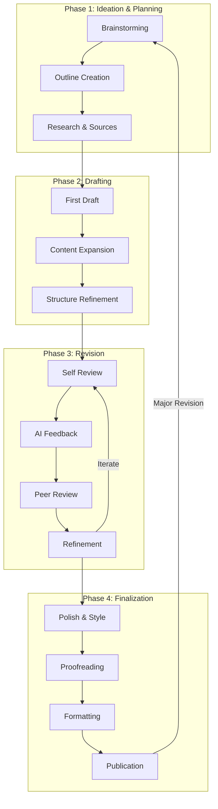
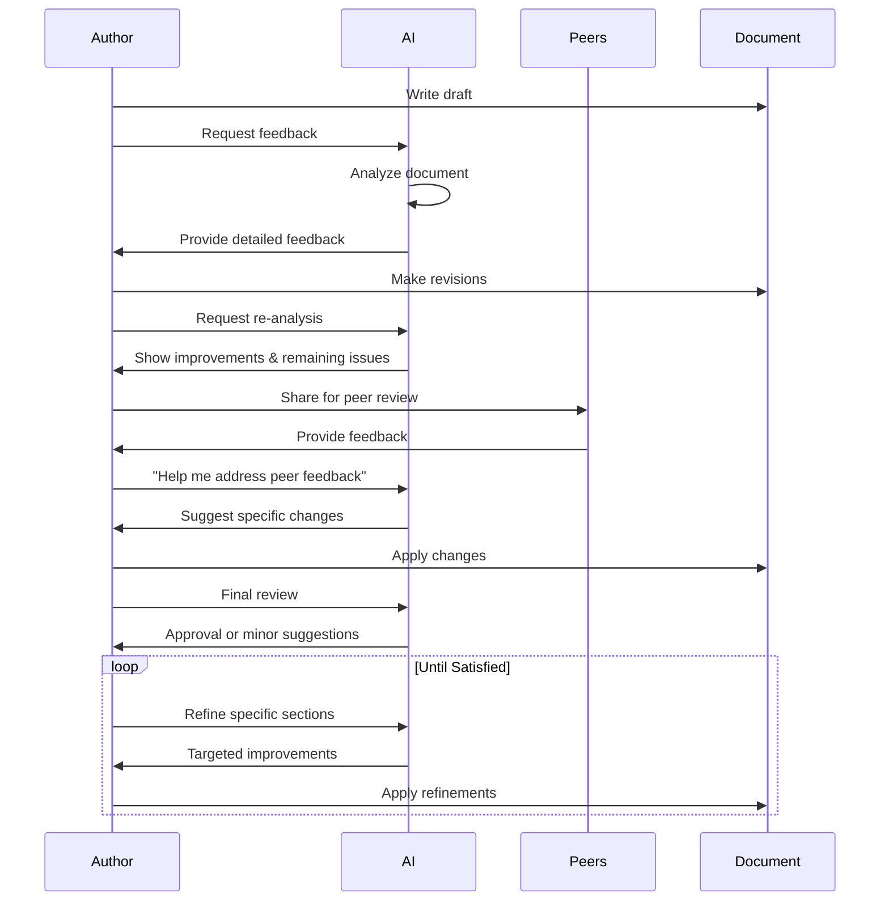
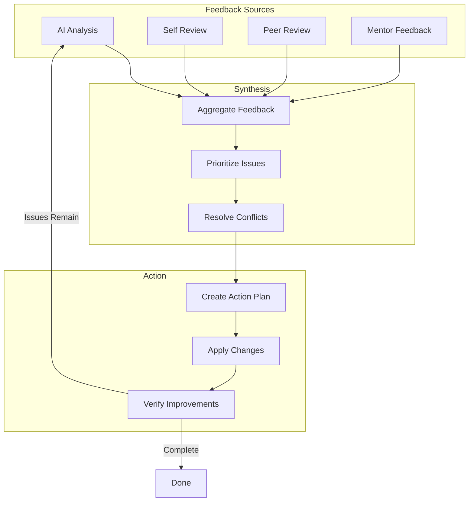

# AI Integration in the Writing Lifecycle

## Overview

This document defines how AI assists throughout the entire writing process, from initial ideation to final refinement, supporting the iterative nature of writing with multiple feedback loops from peers, authors, and AI itself.

## The Writing Lifecycle



## AI Roles Across the Lifecycle

### 1. Ideation & Planning Phase

#### AI as Brainstorming Partner
**Granularity:** Document-level, Section-level

```typescript
interface BrainstormingAssistant {
  // Generate ideas based on topic
  generateIdeas(topic: string, count: number): Promise<Idea[]>;
  
  // Expand on a specific idea
  expandIdea(idea: string, depth: 'brief' | 'detailed'): Promise<string>;
  
  // Suggest related topics
  suggestRelatedTopics(topic: string): Promise<string[]>;
  
  // Create mind map
  createMindMap(centralTopic: string): Promise<MindMap>;
}

interface Idea {
  title: string;
  description: string;
  keyPoints: string[];
  relevance: number; // 0-1 score
}
```

**Example Interaction:**
```
User: "I want to write about climate change impacts"

AI Suggestions:
1. Economic impacts of climate change on agriculture
2. Social displacement due to rising sea levels
3. Technological solutions for carbon capture
4. Policy frameworks for climate adaptation
5. Health implications of changing weather patterns

User selects: "Economic impacts on agriculture"

AI Expands:
- Crop yield changes in different regions
- Water scarcity and irrigation challenges
- Pest and disease pattern shifts
- Market volatility and food security
- Adaptation strategies for farmers
```

#### AI as Outline Generator
**Granularity:** Document-level, Chapter-level

```typescript
interface OutlineGenerator {
  // Generate outline from topic
  generateOutline(
    topic: string,
    documentType: 'paper' | 'book' | 'article',
    depth: number
  ): Promise<Outline>;
  
  // Suggest section improvements
  improveSectionStructure(outline: Outline): Promise<OutlineSuggestion[]>;
  
  // Reorder sections for better flow
  optimizeFlow(outline: Outline): Promise<Outline>;
}

interface Outline {
  title: string;
  sections: OutlineSection[];
}

interface OutlineSection {
  id: string;
  title: string;
  description: string;
  subsections?: OutlineSection[];
  estimatedWordCount: number;
  keyPoints: string[];
}
```

#### AI as Research Assistant
**Granularity:** Topic-level, Paragraph-level

```typescript
interface ResearchAssistant {
  // Find relevant sources
  findSources(query: string, sourceTypes: string[]): Promise<Source[]>;
  
  // Summarize research papers
  summarizePaper(paperId: string, length: 'brief' | 'detailed'): Promise<Summary>;
  
  // Extract key findings
  extractKeyFindings(text: string): Promise<Finding[]>;
  
  // Generate citations
  generateCitation(source: Source, style: CitationStyle): Promise<string>;
  
  // Fact-check claims
  verifyFact(claim: string): Promise<FactCheckResult>;
}
```

### 2. Drafting Phase

#### AI as Writing Companion
**Granularity:** Paragraph-level, Sentence-level

```typescript
interface WritingCompanion {
  // Continue writing from current position
  continueWriting(
    context: WritingContext,
    style: WritingStyle
  ): Promise<string>;
  
  // Expand brief notes into full paragraphs
  expandNotes(
    notes: string,
    targetLength: number,
    style: WritingStyle
  ): Promise<string>;
  
  // Generate alternative phrasings
  rephrase(
    text: string,
    variations: number
  ): Promise<string[]>;
  
  // Fill in gaps
  fillGap(
    before: string,
    after: string,
    intent: string
  ): Promise<string>;
}

interface WritingContext {
  documentType: string;
  currentSection: string;
  precedingText: string; // Last 500 words
  followingText?: string; // Next 200 words if available
  outline: Outline;
  style: WritingStyle;
}

interface WritingStyle {
  tone: 'formal' | 'casual' | 'academic' | 'creative' | 'technical';
  voice: 'active' | 'passive' | 'mixed';
  perspective: 'first-person' | 'third-person';
  audience: 'general' | 'expert' | 'student';
}
```

**Multi-Level Integration:**

```typescript
// Sentence-level assistance
interface SentenceLevelAI {
  // Real-time suggestions as user types
  suggestCompletion(
    partialSentence: string,
    context: WritingContext
  ): Promise<string[]>;
  
  // Improve sentence structure
  improveSentence(
    sentence: string,
    issue: 'clarity' | 'conciseness' | 'flow'
  ): Promise<string>;
  
  // Suggest transitions
  suggestTransition(
    previousSentence: string,
    nextSentence: string
  ): Promise<string[]>;
}

// Paragraph-level assistance
interface ParagraphLevelAI {
  // Generate paragraph from topic sentence
  expandTopicSentence(
    topicSentence: string,
    targetLength: number,
    context: WritingContext
  ): Promise<string>;
  
  // Improve paragraph coherence
  improveCoherence(paragraph: string): Promise<string>;
  
  // Add supporting details
  addSupportingDetails(
    mainPoint: string,
    context: WritingContext
  ): Promise<string[]>;
  
  // Restructure paragraph
  restructureParagraph(
    paragraph: string,
    structure: 'topic-first' | 'topic-last' | 'chronological'
  ): Promise<string>;
}

// Section-level assistance
interface SectionLevelAI {
  // Generate entire section from outline
  generateSection(
    sectionOutline: OutlineSection,
    context: WritingContext
  ): Promise<string>;
  
  // Improve section flow
  improveSectionFlow(
    section: string,
    context: WritingContext
  ): Promise<string>;
  
  // Add transitions between paragraphs
  addParagraphTransitions(section: string): Promise<string>;
  
  // Balance section length
  balanceSection(
    section: string,
    targetLength: number
  ): Promise<string>;
}

// Document-level assistance
interface DocumentLevelAI {
  // Analyze overall structure
  analyzeStructure(document: Document): Promise<StructureAnalysis>;
  
  // Suggest reorganization
  suggestReorganization(document: Document): Promise<ReorganizationPlan>;
  
  // Check consistency
  checkConsistency(document: Document): Promise<ConsistencyReport>;
  
  // Generate executive summary
  generateSummary(
    document: Document,
    length: number
  ): Promise<string>;
}
```

### 3. Revision Phase

#### AI as Feedback Provider
**Granularity:** All levels (Document → Sentence)

```typescript
interface AIFeedbackSystem {
  // Comprehensive document review
  reviewDocument(
    document: Document,
    focusAreas: FocusArea[]
  ): Promise<DocumentReview>;
  
  // Targeted feedback on specific sections
  reviewSection(
    section: string,
    context: WritingContext
  ): Promise<SectionFeedback>;
  
  // Sentence-level suggestions
  reviewSentence(
    sentence: string,
    context: WritingContext
  ): Promise<SentenceFeedback>;
}

interface DocumentReview {
  overallScore: number; // 0-100
  strengths: Strength[];
  weaknesses: Weakness[];
  suggestions: Suggestion[];
  
  // Detailed analysis
  structureAnalysis: StructureAnalysis;
  contentAnalysis: ContentAnalysis;
  styleAnalysis: StyleAnalysis;
  
  // Actionable improvements
  prioritizedImprovements: Improvement[];
}

interface Improvement {
  priority: 'critical' | 'high' | 'medium' | 'low';
  category: 'structure' | 'content' | 'style' | 'grammar';
  location: {
    section?: string;
    paragraph?: number;
    sentence?: number;
  };
  issue: string;
  suggestion: string;
  example?: {
    before: string;
    after: string;
  };
  impact: string; // Why this matters
}

interface StructureAnalysis {
  logicalFlow: {
    score: number;
    issues: FlowIssue[];
  };
  sectionBalance: {
    score: number;
    imbalances: SectionImbalance[];
  };
  transitions: {
    score: number;
    missingTransitions: TransitionGap[];
  };
}

interface ContentAnalysis {
  clarity: {
    score: number;
    unclearPassages: UnclearPassage[];
  };
  depth: {
    score: number;
    shallowSections: ShallowSection[];
  };
  evidence: {
    score: number;
    unsupportedClaims: UnsupportedClaim[];
  };
  redundancy: {
    score: number;
    redundantContent: RedundantContent[];
  };
}

interface StyleAnalysis {
  consistency: {
    score: number;
    inconsistencies: StyleInconsistency[];
  };
  tone: {
    score: number;
    toneShifts: ToneShift[];
  };
  readability: {
    score: number;
    difficultPassages: DifficultPassage[];
  };
  engagement: {
    score: number;
    suggestions: EngagementSuggestion[];
  };
}
```

#### Iterative Refinement Loop



#### AI as Peer Review Synthesizer

```typescript
interface PeerReviewSynthesizer {
  // Combine feedback from multiple reviewers
  synthesizeFeedback(
    reviews: PeerReview[]
  ): Promise<SynthesizedFeedback>;
  
  // Prioritize conflicting feedback
  resolveConflicts(
    conflictingFeedback: Feedback[]
  ): Promise<ConflictResolution>;
  
  // Generate action plan from feedback
  createActionPlan(
    feedback: SynthesizedFeedback
  ): Promise<ActionPlan>;
}

interface SynthesizedFeedback {
  commonThemes: Theme[];
  criticalIssues: Issue[];
  suggestions: PrioritizedSuggestion[];
  conflictingOpinions: Conflict[];
}

interface ActionPlan {
  immediateActions: Action[];
  shortTermActions: Action[];
  longTermActions: Action[];
  estimatedEffort: {
    hours: number;
    complexity: 'low' | 'medium' | 'high';
  };
}
```

### 4. Finalization Phase

#### AI as Polish & Style Editor
**Granularity:** Sentence-level, Word-level

```typescript
interface StylePolisher {
  // Final grammar and spelling check
  finalProofread(document: Document): Promise<ProofreadReport>;
  
  // Enhance word choice
  enhanceVocabulary(
    text: string,
    level: 'simple' | 'moderate' | 'advanced'
  ): Promise<string>;
  
  // Ensure consistency
  enforceConsistency(
    document: Document,
    styleGuide: StyleGuide
  ): Promise<ConsistencyReport>;
  
  // Optimize for readability
  optimizeReadability(
    text: string,
    targetAudience: Audience
  ): Promise<string>;
}

interface ProofreadReport {
  grammarErrors: GrammarError[];
  spellingErrors: SpellingError[];
  punctuationIssues: PunctuationIssue[];
  styleIssues: StyleIssue[];
  
  // Confidence scores
  overallConfidence: number;
  falsePositiveRisk: number;
}
```

## Recommended Integration Levels

### Level 1: Sentence-Level (Real-time)
**When:** During active writing
**Frequency:** Continuous
**Intrusiveness:** Low (subtle suggestions)

```typescript
interface RealtimeAssistance {
  // Auto-complete as user types
  autoComplete: boolean;
  
  // Show suggestions after pause
  suggestionDelay: number; // milliseconds
  
  // Inline grammar corrections
  inlineCorrections: boolean;
  
  // Confidence threshold for showing suggestions
  confidenceThreshold: number; // 0-1
}
```

**UI Pattern:**
- Subtle underlines for issues
- Inline suggestions on hover
- Keyboard shortcuts for quick acceptance
- Non-blocking, dismissible

### Level 2: Paragraph-Level (On-demand)
**When:** After completing a paragraph
**Frequency:** User-triggered or automatic after pause
**Intrusiveness:** Medium (side panel suggestions)

```typescript
interface ParagraphAssistance {
  // Trigger options
  trigger: 'manual' | 'auto-after-pause' | 'end-of-paragraph';
  
  // Analysis depth
  analysisDepth: 'quick' | 'thorough';
  
  // Suggestion types
  suggestionTypes: {
    coherence: boolean;
    clarity: boolean;
    expansion: boolean;
    restructuring: boolean;
  };
}
```

**UI Pattern:**
- Side panel with suggestions
- Highlight affected text
- Preview changes before applying
- Batch apply multiple suggestions

### Level 3: Section-Level (Periodic)
**When:** After completing a section
**Frequency:** User-triggered or milestone-based
**Intrusiveness:** Medium-High (dedicated review mode)

```typescript
interface SectionAssistance {
  // Review triggers
  triggers: {
    manualReview: boolean;
    afterWordCount: number;
    afterTimeElapsed: number; // minutes
  };
  
  // Review scope
  scope: {
    structure: boolean;
    flow: boolean;
    consistency: boolean;
    depth: boolean;
  };
}
```

**UI Pattern:**
- Dedicated review mode
- Section-by-section navigation
- Visual indicators of issues
- Comparison view (before/after)

### Level 4: Document-Level (Milestone)
**When:** Major milestones (draft complete, pre-submission)
**Frequency:** Infrequent, user-triggered
**Intrusiveness:** High (comprehensive review)

```typescript
interface DocumentAssistance {
  // Comprehensive analysis
  analysis: {
    structure: boolean;
    content: boolean;
    style: boolean;
    citations: boolean;
    formatting: boolean;
  };
  
  // Report generation
  generateReport: boolean;
  
  // Comparison with standards
  compareToStandards: {
    journalGuidelines?: string;
    styleGuide?: string;
    previousVersions?: boolean;
  };
}
```

**UI Pattern:**
- Full-screen review dashboard
- Detailed analytics and metrics
- Prioritized action items
- Export review report

## Adaptive AI Behavior

### Learning User Preferences

```typescript
interface UserPreferenceLearning {
  // Track acceptance/rejection of suggestions
  trackFeedback(
    suggestionId: string,
    action: 'accept' | 'reject' | 'modify'
  ): void;
  
  // Learn writing style
  analyzeWritingStyle(
    userDocuments: Document[]
  ): Promise<UserStyle>;
  
  // Adapt suggestions
  adaptSuggestions(
    userStyle: UserStyle,
    context: WritingContext
  ): Promise<AdaptedSuggestions>;
}

interface UserStyle {
  preferredTone: string;
  vocabularyLevel: string;
  sentenceLength: 'short' | 'medium' | 'long' | 'varied';
  paragraphStructure: string;
  commonPhrases: string[];
  avoidedPhrases: string[];
}
```

### Context-Aware Assistance

```typescript
interface ContextAwareAI {
  // Adjust based on document type
  adaptToDocumentType(type: DocumentType): void;
  
  // Adjust based on writing phase
  adaptToPhase(phase: WritingPhase): void;
  
  // Adjust based on user expertise
  adaptToExpertise(level: ExpertiseLevel): void;
  
  // Adjust based on time pressure
  adaptToDeadline(deadline: Date): void;
}

type WritingPhase = 'ideation' | 'drafting' | 'revision' | 'finalization';
type ExpertiseLevel = 'beginner' | 'intermediate' | 'advanced' | 'expert';
```

## Feedback Loop Integration

### Multi-Source Feedback Synthesis



## Recommended Implementation Strategy

### Phase 1: Core Assistance (MVP)
1. **Sentence-level real-time suggestions**
   - Grammar and spelling
   - Basic style improvements
   - Auto-completion

2. **Paragraph-level on-demand**
   - Coherence checking
   - Expansion suggestions
   - Basic restructuring

### Phase 2: Enhanced Feedback
3. **Section-level periodic review**
   - Structure analysis
   - Flow optimization
   - Consistency checking

4. **AI feedback integration**
   - Comprehensive document review
   - Prioritized improvements
   - Before/after comparisons

### Phase 3: Advanced Integration
5. **Document-level analysis**
   - Full document review
   - Citation checking
   - Publication readiness

6. **Multi-source synthesis**
   - Peer review integration
   - Feedback aggregation
   - Conflict resolution

### Phase 4: Adaptive Intelligence
7. **Learning and adaptation**
   - User style learning
   - Context-aware suggestions
   - Personalized assistance

## Best Practices

### 1. Progressive Disclosure
- Start with minimal, non-intrusive suggestions
- Gradually introduce more advanced features
- Let users control assistance level

### 2. Transparency
- Explain why suggestions are made
- Show confidence levels
- Allow users to provide feedback

### 3. User Control
- Easy to dismiss suggestions
- Adjustable assistance levels
- Opt-in for advanced features

### 4. Context Preservation
- Maintain document context across sessions
- Remember user preferences
- Track revision history

### 5. Performance
- Real-time suggestions < 100ms
- Paragraph analysis < 2s
- Document review < 30s

## Conclusion

AI should act as a **collaborative partner** throughout the writing lifecycle, providing assistance at multiple granularity levels:

- **Sentence-level**: Real-time, subtle, continuous
- **Paragraph-level**: On-demand, focused, actionable
- **Section-level**: Periodic, comprehensive, structural
- **Document-level**: Milestone-based, holistic, strategic

The key is **adaptive assistance** that learns from user behavior, respects user preferences, and provides value without being intrusive. The system should support the iterative nature of writing with seamless integration of feedback from AI, peers, and self-review.