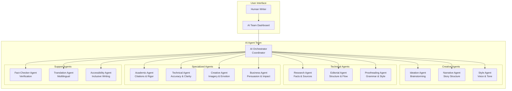
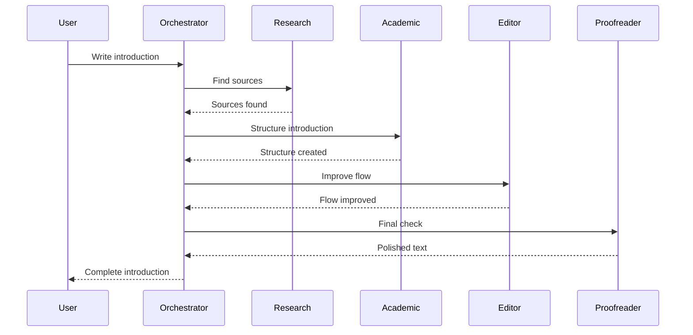
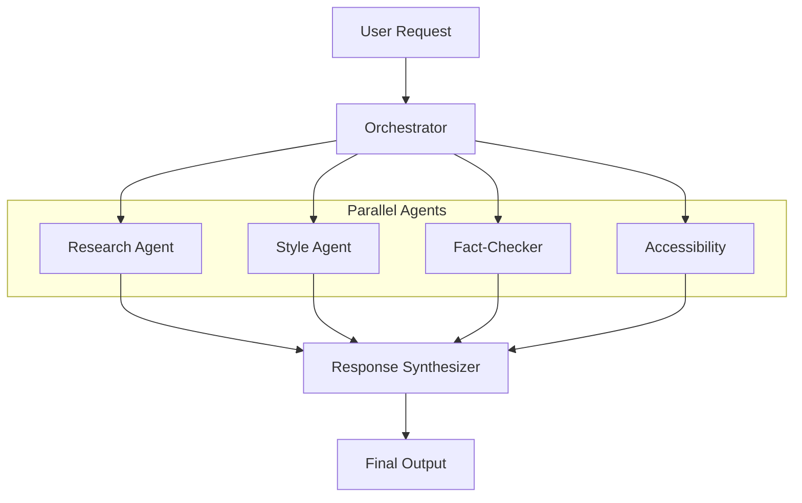
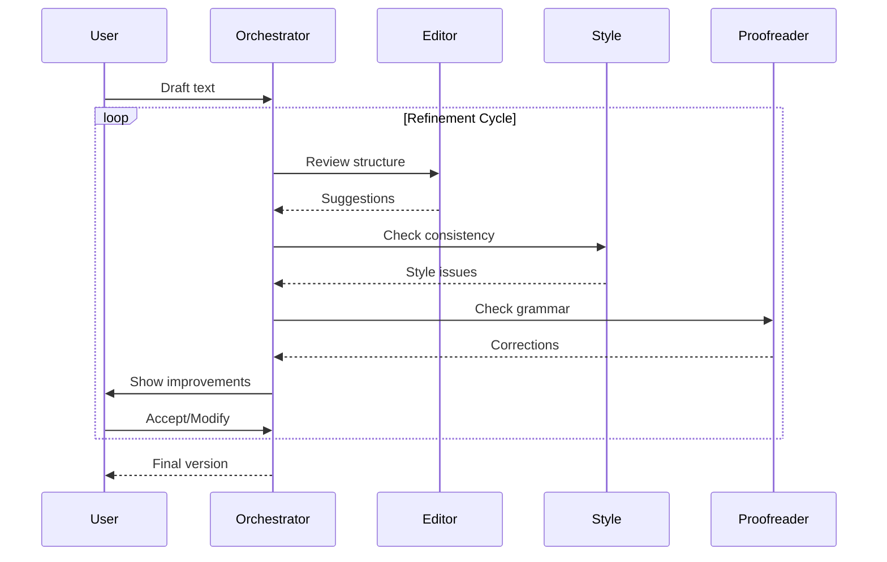

# Multi-Agent AI System for Advanced Writing Assistance

## Vision

A sophisticated AI ecosystem where multiple specialized AI agents collaborate to provide comprehensive writing assistance, each with distinct expertise and responsibilities, working together like a virtual writing team.

## The AI Writing Team



## Core AI Agents

### 1. AI Orchestrator (Coordinator)

**Role**: Central coordinator that routes tasks to appropriate specialized agents and synthesizes their outputs.

```typescript
interface AIOrchestrator {
  // Analyze request and route to appropriate agents
  routeRequest(
    request: WritingRequest,
    context: DocumentContext
  ): Promise<AgentAssignment[]>;
  
  // Coordinate multiple agents
  coordinateAgents(
    agents: AIAgent[],
    task: Task
  ): Promise<CoordinatedResponse>;
  
  // Synthesize responses from multiple agents
  synthesizeResponses(
    responses: AgentResponse[]
  ): Promise<SynthesizedOutput>;
  
  // Resolve conflicts between agent suggestions
  resolveConflicts(
    conflictingResponses: AgentResponse[]
  ): Promise<ResolvedResponse>;
  
  // Learn from user feedback
  learnFromFeedback(
    feedback: UserFeedback,
    agentResponses: AgentResponse[]
  ): Promise<void>;
}

interface AgentAssignment {
  agent: AIAgent;
  task: Task;
  priority: number;
  dependencies: string[]; // Other agents this depends on
}

interface CoordinatedResponse {
  primaryResponse: AgentResponse;
  supportingResponses: AgentResponse[];
  synthesis: string;
  confidence: number;
}
```

**Example Coordination:**
```
User: "Help me write an introduction for my climate change paper"

Orchestrator analyzes:
- Document type: Academic paper
- Section: Introduction
- Needs: Research + Academic rigor + Clear structure

Orchestrator assigns:
1. Research Agent → Find recent climate data and key studies
2. Academic Agent → Structure introduction (hook, context, thesis)
3. Editor Agent → Ensure logical flow
4. Fact-Checker → Verify all claims

Orchestrator synthesizes all inputs into cohesive introduction
```

### 2. Ideation Agent (Brainstorming Specialist)

**Role**: Generate ideas, explore possibilities, create mind maps, suggest angles.

```typescript
interface IdeationAgent extends AIAgent {
  // Generate creative ideas
  brainstorm(
    topic: string,
    constraints: Constraints,
    count: number
  ): Promise<Idea[]>;
  
  // Explore different angles
  exploreAngles(
    topic: string,
    perspective: Perspective[]
  ): Promise<Angle[]>;
  
  // Create mind maps
  createMindMap(
    centralIdea: string,
    depth: number
  ): Promise<MindMap>;
  
  // Suggest unexpected connections
  findConnections(
    concepts: string[]
  ): Promise<Connection[]>;
  
  // Generate "what if" scenarios
  generateScenarios(
    premise: string,
    count: number
  ): Promise<Scenario[]>;
}

interface Idea {
  title: string;
  description: string;
  novelty: number; // 0-1, how unique
  feasibility: number; // 0-1, how practical
  impact: number; // 0-1, potential impact
  relatedConcepts: string[];
}
```

**Specialization**: Creative thinking, divergent exploration, unconventional connections.

### 3. Research Agent (Knowledge Specialist)

**Role**: Find sources, verify facts, summarize research, manage citations.

```typescript
interface ResearchAgent extends AIAgent {
  // Deep research on topic
  conductResearch(
    query: string,
    depth: 'surface' | 'moderate' | 'deep',
    sources: SourceType[]
  ): Promise<ResearchReport>;
  
  // Find and evaluate sources
  findSources(
    query: string,
    criteria: SourceCriteria
  ): Promise<Source[]>;
  
  // Synthesize multiple sources
  synthesizeSources(
    sources: Source[],
    question: string
  ): Promise<Synthesis>;
  
  // Track citation network
  buildCitationNetwork(
    paper: Paper
  ): Promise<CitationNetwork>;
  
  // Monitor latest research
  trackLatestResearch(
    topics: string[],
    frequency: 'daily' | 'weekly'
  ): Promise<ResearchUpdate[]>;
}

interface ResearchReport {
  summary: string;
  keyFindings: Finding[];
  sources: Source[];
  gaps: ResearchGap[];
  recommendations: string[];
  citationGraph: CitationNetwork;
}

interface Source {
  id: string;
  type: 'paper' | 'book' | 'article' | 'dataset' | 'report';
  title: string;
  authors: string[];
  year: number;
  credibility: number; // 0-1
  relevance: number; // 0-1
  summary: string;
  keyQuotes: Quote[];
  citationCount: number;
}
```

**Specialization**: Academic rigor, source evaluation, fact verification, citation management.

### 4. Narrative Agent (Story Structure Specialist)

**Role**: Structure narratives, create compelling arcs, develop characters (for fiction).

```typescript
interface NarrativeAgent extends AIAgent {
  // Analyze story structure
  analyzeStructure(
    narrative: string
  ): Promise<StructureAnalysis>;
  
  // Suggest plot improvements
  improvePlot(
    plot: Plot,
    issues: PlotIssue[]
  ): Promise<PlotSuggestion[]>;
  
  // Develop characters
  developCharacter(
    character: Character,
    role: CharacterRole
  ): Promise<CharacterProfile>;
  
  // Create story arcs
  createArc(
    premise: string,
    arcType: ArcType
  ): Promise<StoryArc>;
  
  // Suggest pacing improvements
  improvePacing(
    narrative: string
  ): Promise<PacingSuggestion[]>;
}

interface StoryArc {
  acts: Act[];
  climax: string;
  resolution: string;
  themes: string[];
  emotionalJourney: EmotionalBeat[];
}

interface EmotionalBeat {
  position: number; // 0-1 through story
  emotion: string;
  intensity: number; // 0-1
  purpose: string;
}
```

**Specialization**: Narrative structure, character development, pacing, emotional resonance.

### 5. Style Agent (Voice & Tone Specialist)

**Role**: Maintain consistent voice, adjust tone, enhance style.

```typescript
interface StyleAgent extends AIAgent {
  // Analyze writing style
  analyzeStyle(
    text: string
  ): Promise<StyleProfile>;
  
  // Adapt to target style
  adaptStyle(
    text: string,
    targetStyle: StyleProfile
  ): Promise<string>;
  
  // Ensure consistency
  ensureConsistency(
    document: Document,
    styleGuide: StyleGuide
  ): Promise<ConsistencyReport>;
  
  // Enhance voice
  enhanceVoice(
    text: string,
    voiceCharacteristics: VoiceProfile
  ): Promise<string>;
  
  // Adjust tone
  adjustTone(
    text: string,
    targetTone: Tone
  ): Promise<string>;
}

interface StyleProfile {
  vocabulary: {
    level: 'simple' | 'moderate' | 'advanced';
    domain: string[];
  };
  sentenceStructure: {
    averageLength: number;
    complexity: number;
    variety: number;
  };
  voice: {
    perspective: 'first' | 'second' | 'third';
    formality: number; // 0-1
    personality: string[];
  };
  tone: {
    primary: string;
    secondary: string[];
    consistency: number;
  };
  rhetoric: {
    devices: string[];
    frequency: number;
  };
}
```

**Specialization**: Voice consistency, tone adjustment, stylistic enhancement, brand alignment.

### 6. Editorial Agent (Structure & Flow Specialist)

**Role**: Improve document structure, enhance flow, optimize organization.

```typescript
interface EditorialAgent extends AIAgent {
  // Analyze document structure
  analyzeStructure(
    document: Document
  ): Promise<StructuralAnalysis>;
  
  // Suggest reorganization
  suggestReorganization(
    document: Document,
    goals: OrganizationGoal[]
  ): Promise<ReorganizationPlan>;
  
  // Improve transitions
  improveTransitions(
    sections: Section[]
  ): Promise<TransitionSuggestion[]>;
  
  // Balance content
  balanceContent(
    document: Document,
    targetBalance: BalanceTarget
  ): Promise<BalanceSuggestion[]>;
  
  // Optimize for audience
  optimizeForAudience(
    document: Document,
    audience: Audience
  ): Promise<OptimizationPlan>;
}

interface StructuralAnalysis {
  hierarchy: HierarchyAnalysis;
  flow: FlowAnalysis;
  balance: BalanceAnalysis;
  coherence: CoherenceAnalysis;
  recommendations: StructuralRecommendation[];
}

interface ReorganizationPlan {
  currentStructure: Structure;
  proposedStructure: Structure;
  rationale: string;
  impact: ImpactAssessment;
  steps: ReorganizationStep[];
}
```

**Specialization**: Document architecture, logical flow, content organization, reader experience.

### 7. Academic Agent (Scholarly Writing Specialist)

**Role**: Ensure academic rigor, manage citations, follow conventions.

```typescript
interface AcademicAgent extends AIAgent {
  // Ensure academic rigor
  ensureRigor(
    text: string,
    field: AcademicField
  ): Promise<RigorAssessment>;
  
  // Manage citations
  manageCitations(
    document: Document,
    style: CitationStyle
  ): Promise<CitationReport>;
  
  // Check methodology
  reviewMethodology(
    methodology: Methodology
  ): Promise<MethodologyReview>;
  
  // Suggest theoretical frameworks
  suggestFrameworks(
    research: ResearchContext
  ): Promise<TheoreticalFramework[]>;
  
  // Ensure compliance with guidelines
  checkCompliance(
    document: Document,
    guidelines: JournalGuidelines
  ): Promise<ComplianceReport>;
}

interface RigorAssessment {
  evidenceSupport: number; // 0-1
  logicalConsistency: number;
  methodologicalSoundness: number;
  theoreticalGrounding: number;
  gaps: RigorGap[];
  recommendations: string[];
}
```

**Specialization**: Academic standards, research methodology, citation management, scholarly conventions.

### 8. Technical Agent (Technical Writing Specialist)

**Role**: Ensure technical accuracy, clarity, and precision.

```typescript
interface TechnicalAgent extends AIAgent {
  // Verify technical accuracy
  verifyAccuracy(
    technicalContent: string,
    domain: TechnicalDomain
  ): Promise<AccuracyReport>;
  
  // Simplify complex concepts
  simplifyComplexity(
    text: string,
    targetAudience: Audience
  ): Promise<SimplifiedVersion[]>;
  
  // Create technical diagrams
  suggestDiagrams(
    concept: string
  ): Promise<DiagramSuggestion[]>;
  
  // Ensure precision
  improvePrecision(
    text: string
  ): Promise<PrecisionSuggestion[]>;
  
  // Check terminology consistency
  checkTerminology(
    document: Document,
    glossary: Glossary
  ): Promise<TerminologyReport>;
}
```

**Specialization**: Technical accuracy, clarity for complex topics, precision, terminology.

### 9. Creative Agent (Literary & Artistic Specialist)

**Role**: Enhance imagery, metaphors, emotional impact, literary devices.

```typescript
interface CreativeAgent extends AIAgent {
  // Enhance imagery
  enhanceImagery(
    text: string,
    intensity: number
  ): Promise<string>;
  
  // Suggest metaphors
  suggestMetaphors(
    concept: string,
    context: Context
  ): Promise<Metaphor[]>;
  
  // Improve emotional impact
  enhanceEmotion(
    text: string,
    targetEmotion: Emotion
  ): Promise<string>;
  
  // Add literary devices
  addLiteraryDevices(
    text: string,
    devices: LiteraryDevice[]
  ): Promise<EnhancedText>;
  
  // Create vivid descriptions
  createDescription(
    subject: string,
    senses: Sense[]
  ): Promise<Description>;
}

interface Metaphor {
  original: string;
  metaphor: string;
  explanation: string;
  effectiveness: number;
  culturalRelevance: number;
}
```

**Specialization**: Literary devices, imagery, emotional resonance, creative expression.

### 10. Fact-Checker Agent (Verification Specialist)

**Role**: Verify claims, check facts, identify misinformation.

```typescript
interface FactCheckerAgent extends AIAgent {
  // Verify factual claims
  verifyFacts(
    claims: Claim[]
  ): Promise<FactCheckResult[]>;
  
  // Identify unsupported claims
  findUnsupportedClaims(
    text: string
  ): Promise<UnsupportedClaim[]>;
  
  // Check for bias
  detectBias(
    text: string
  ): Promise<BiasReport>;
  
  // Verify statistics
  verifyStatistics(
    statistics: Statistic[]
  ): Promise<StatisticsVerification[]>;
  
  // Monitor claim updates
  trackClaimUpdates(
    claims: Claim[]
  ): Promise<ClaimUpdate[]>;
}

interface FactCheckResult {
  claim: string;
  verdict: 'true' | 'false' | 'partially-true' | 'unverifiable';
  confidence: number;
  sources: Source[];
  explanation: string;
  context: string;
}
```

**Specialization**: Fact verification, source credibility, bias detection, accuracy.

### 11. Accessibility Agent (Inclusive Writing Specialist)

**Role**: Ensure content is accessible, inclusive, and clear for all audiences.

```typescript
interface AccessibilityAgent extends AIAgent {
  // Check readability
  assessReadability(
    text: string,
    targetAudience: Audience
  ): Promise<ReadabilityReport>;
  
  // Suggest inclusive language
  improveInclusivity(
    text: string
  ): Promise<InclusivitySuggestion[]>;
  
  // Generate alt-text
  generateAltText(
    image: Image,
    context: Context
  ): Promise<AltText>;
  
  // Simplify jargon
  simplifyJargon(
    text: string,
    glossary: Glossary
  ): Promise<SimplifiedText>;
  
  // Check for bias
  detectLanguageBias(
    text: string
  ): Promise<BiasReport>;
}

interface ReadabilityReport {
  scores: {
    fleschKincaid: number;
    gunningFog: number;
    smog: number;
    automated: number;
  };
  gradeLevel: number;
  recommendations: ReadabilityRecommendation[];
  difficultSentences: Sentence[];
}
```

**Specialization**: Readability, inclusive language, accessibility standards, plain language.

## Agent Collaboration Patterns

### Pattern 1: Sequential Processing



### Pattern 2: Parallel Processing



### Pattern 3: Iterative Refinement



### Pattern 4: Consensus Building

```typescript
interface ConsensusBuilder {
  // Get opinions from multiple agents
  gatherOpinions(
    text: string,
    agents: AIAgent[]
  ): Promise<Opinion[]>;
  
  // Build consensus
  buildConsensus(
    opinions: Opinion[]
  ): Promise<Consensus>;
  
  // Handle disagreements
  resolveDisagreements(
    conflictingOpinions: Opinion[]
  ): Promise<Resolution>;
}

interface Opinion {
  agent: AIAgent;
  assessment: string;
  confidence: number;
  reasoning: string;
  suggestions: Suggestion[];
}

interface Consensus {
  agreement: number; // 0-1
  sharedView: string;
  minorityViews: Opinion[];
  recommendation: string;
}
```

## Advanced Features

### 1. Agent Specialization by Document Type

```typescript
interface DocumentTypeSpecialization {
  // Academic paper team
  academicPaper: {
    primary: ['Research', 'Academic', 'Editor'];
    supporting: ['FactChecker', 'Proofreader'];
    optional: ['Technical'];
  };
  
  // Novel team
  novel: {
    primary: ['Narrative', 'Creative', 'Style'];
    supporting: ['Editor', 'Proofreader'];
    optional: ['Research'];
  };
  
  // Business report team
  businessReport: {
    primary: ['Business', 'Editor', 'Technical'];
    supporting: ['Research', 'Proofreader'];
    optional: ['Accessibility'];
  };
  
  // Blog post team
  blogPost: {
    primary: ['Creative', 'Style', 'Editor'];
    supporting: ['Proofreader', 'Accessibility'];
    optional: ['Research', 'FactChecker'];
  };
}
```

### 2. Learning & Adaptation

```typescript
interface AgentLearning {
  // Learn from user feedback
  learnFromFeedback(
    agentId: string,
    feedback: Feedback
  ): Promise<void>;
  
  // Adapt to user preferences
  adaptToUser(
    userId: string,
    interactions: Interaction[]
  ): Promise<UserProfile>;
  
  // Improve collaboration
  optimizeCollaboration(
    agentTeam: AIAgent[],
    performance: PerformanceMetrics
  ): Promise<CollaborationStrategy>;
}
```

### 3. Agent Communication Protocol

```typescript
interface AgentCommunication {
  // Share context between agents
  shareContext(
    fromAgent: AIAgent,
    toAgent: AIAgent,
    context: Context
  ): Promise<void>;
  
  // Request assistance
  requestAssistance(
    requestingAgent: AIAgent,
    task: Task,
    preferredAgents: string[]
  ): Promise<AgentResponse[]>;
  
  // Negotiate conflicts
  negotiateConflict(
    agents: AIAgent[],
    conflict: Conflict
  ): Promise<Resolution>;
}
```

## Implementation Roadmap

### Phase 1: Core Agents (Months 1-3)
- AI Orchestrator
- Research Agent
- Editorial Agent
- Proofreading Agent

### Phase 2: Specialized Agents (Months 4-6)
- Academic Agent
- Style Agent
- Fact-Checker Agent
- Accessibility Agent

### Phase 3: Creative Agents (Months 7-9)
- Narrative Agent
- Creative Agent
- Ideation Agent
- Technical Agent

### Phase 4: Advanced Features (Months 10-12)
- Agent collaboration optimization
- Learning and adaptation
- Consensus building
- Performance analytics

## User Interface

### AI Team Dashboard

```typescript
interface AITeamDashboard {
  // Active agents
  activeAgents: AgentStatus[];
  
  // Current tasks
  currentTasks: Task[];
  
  // Agent recommendations
  recommendations: Recommendation[];
  
  // Performance metrics
  metrics: {
    responseTime: number;
    accuracy: number;
    userSatisfaction: number;
    costEfficiency: number;
  };
  
  // User controls
  controls: {
    enabledAgents: string[];
    agentPriorities: Record<string, number>;
    automationLevel: 'manual' | 'assisted' | 'automatic';
  };
}
```

### Agent Interaction Modes

1. **Silent Mode**: Agents work in background, show results only
2. **Collaborative Mode**: Show agent thinking process
3. **Educational Mode**: Explain reasoning and teach
4. **Expert Mode**: Minimal intervention, trust user judgment

## Benefits of Multi-Agent System

### 1. Specialization
- Each agent excels in specific domain
- Higher quality outputs
- More nuanced understanding

### 2. Scalability
- Add new agents without disrupting existing ones
- Parallel processing for faster results
- Distribute computational load

### 3. Flexibility
- Customize agent team per document type
- Enable/disable agents as needed
- Adjust agent priorities

### 4. Robustness
- Multiple perspectives reduce errors
- Consensus building improves reliability
- Fallback options if one agent fails

### 5. Continuous Improvement
- Agents learn independently
- Collaboration patterns evolve
- User feedback improves all agents

## Conclusion

The multi-agent AI system represents the future of writing assistance - a collaborative team of specialized AI agents working together to support every aspect of the writing process. This approach provides:

- **Comprehensive coverage** of all writing needs
- **Specialized expertise** for different domains
- **Collaborative intelligence** through agent coordination
- **Adaptive assistance** that learns and improves
- **Scalable architecture** for future enhancements

This system transforms AI from a single tool into a complete writing team, providing the depth and breadth of support needed for professional-quality writing across all genres and formats.