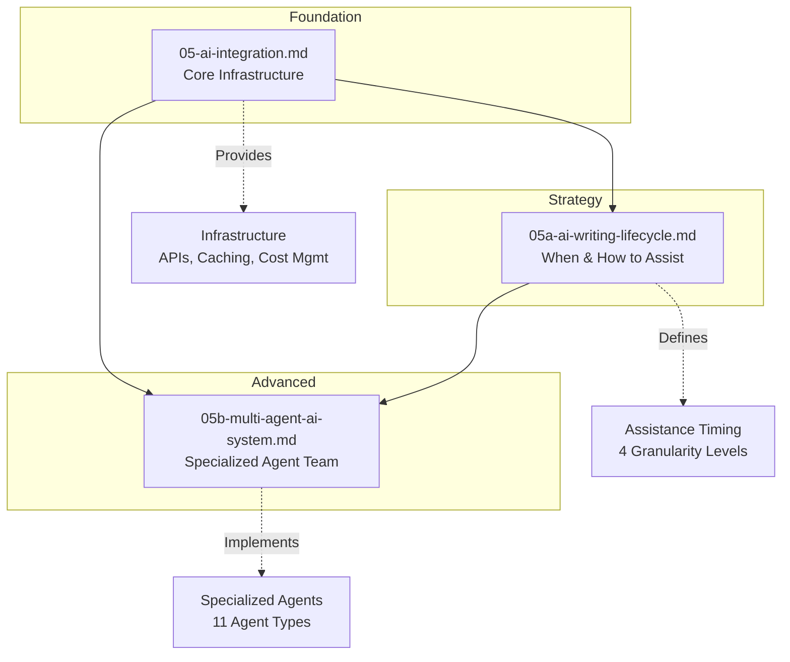

# AI Integration Guide: How the Pieces Fit Together

## Overview

This guide explains how the three AI design documents work together to create a comprehensive AI assistance system.

## Document Relationships



## How They Work Together

### 1. Foundation: Core AI Infrastructure (05-ai-integration.md)

**Purpose:** Provides the technical foundation for all AI features.

**Key Components:**
- AI Orchestrator service
- Prompt engineering system
- Context builder
- Response processor
- Caching strategy (multi-level)
- Cost optimizer
- Usage tracking

**This is Required For:** All AI features, regardless of implementation approach.

**Implementation:** Phase 1 (MVP)

### 2. Strategy: AI Writing Lifecycle (05a-ai-writing-lifecycle.md)

**Purpose:** Defines when and how AI assists throughout the writing process.

**Key Concepts:**
- 4 levels of granularity (Sentence → Document)
- Writing phases (Ideation → Finalization)
- Feedback loop integration
- Adaptive behavior

**This Builds On:** Core infrastructure from 05-ai-integration.md

**Implementation:** Phase 1-2 (MVP + Enhanced)

### 3. Advanced: Multi-Agent System (05b-multi-agent-ai-system.md)

**Purpose:** Provides specialized AI agents for comprehensive assistance.

**Key Concepts:**
- 11 specialized agents
- Agent collaboration patterns
- Consensus building
- Learning and adaptation

**This Builds On:** Both 05-ai-integration.md and 05a-ai-writing-lifecycle.md

**Implementation:** Phase 3-4 (Advanced + Scale)

## Implementation Roadmap

### Phase 1: MVP (Months 1-3)
**Use:** 05-ai-integration.md + 05a-ai-writing-lifecycle.md (Levels 1-2)

```typescript
// Single AI service with basic capabilities
class AIService {
  // From 05-ai-integration.md
  private orchestrator: AIOrchestrator;
  private promptEngine: PromptEngine;
  private cache: AICache;
  
  // Implements 05a levels 1-2
  async sentenceLevelAssist(context: Context): Promise<Suggestion[]> {
    // Real-time grammar, completion
  }
  
  async paragraphLevelAssist(context: Context): Promise<Suggestion[]> {
    // On-demand coherence, expansion
  }
}
```

**Features:**
- Sentence-level real-time suggestions
- Paragraph-level on-demand assistance
- Basic content generation
- Grammar and style checking

### Phase 2: Enhanced (Months 4-6)
**Add:** 05a-ai-writing-lifecycle.md (Levels 3-4)

```typescript
// Extended AI service
class EnhancedAIService extends AIService {
  // Add section and document level
  async sectionLevelReview(section: Section): Promise<Review> {
    // Structure analysis, flow optimization
  }
  
  async documentLevelReview(document: Document): Promise<ComprehensiveReview> {
    // Full document analysis
  }
}
```

**Features:**
- Section-level periodic review
- Document-level comprehensive analysis
- Version comparison
- Multi-source feedback synthesis

### Phase 3: Multi-Agent (Months 7-9)
**Add:** 05b-multi-agent-ai-system.md (Core Agents)

```typescript
// Introduce specialized agents
class MultiAgentAIService extends EnhancedAIService {
  private agents: {
    research: ResearchAgent;
    editorial: EditorialAgent;
    proofreader: ProofreadingAgent;
    academic: AcademicAgent;
  };
  
  private agentOrchestrator: AgentOrchestrator;
  
  async processWithAgents(request: Request): Promise<Response> {
    // Route to appropriate agents
    const assignments = await this.agentOrchestrator.routeRequest(request);
    
    // Coordinate agent responses
    const responses = await this.agentOrchestrator.coordinateAgents(assignments);
    
    // Synthesize final output
    return this.agentOrchestrator.synthesizeResponses(responses);
  }
}
```

**Features:**
- 4-5 core specialized agents
- Basic agent coordination
- Sequential and parallel processing
- Agent-specific expertise

### Phase 4: Advanced Multi-Agent (Months 10-12)
**Complete:** Full 05b-multi-agent-ai-system.md implementation

```typescript
// Full multi-agent system
class AdvancedMultiAgentSystem extends MultiAgentAIService {
  private agents: {
    // All 11 agents
    orchestrator: AIOrchestrator;
    ideation: IdeationAgent;
    research: ResearchAgent;
    narrative: NarrativeAgent;
    style: StyleAgent;
    editorial: EditorialAgent;
    academic: AcademicAgent;
    technical: TechnicalAgent;
    creative: CreativeAgent;
    factChecker: FactCheckerAgent;
    accessibility: AccessibilityAgent;
  };
  
  private collaborationEngine: CollaborationEngine;
  private consensusBuilder: ConsensusBuilder;
  private learningSystem: AgentLearning;
  
  async processWithFullTeam(request: Request): Promise<Response> {
    // Advanced coordination with all patterns
    // - Sequential processing
    // - Parallel processing
    // - Iterative refinement
    // - Consensus building
  }
}
```

**Features:**
- All 11 specialized agents
- Advanced collaboration patterns
- Consensus building
- Learning and adaptation
- Document-type specialization

## Migration Path

### From Single AI to Multi-Agent

The beauty of this design is that **no rewrite is needed**. The migration is gradual:

```typescript
// Phase 1: Single AI
const aiService = new AIService(config);

// Phase 2: Enhanced (same interface, more features)
const aiService = new EnhancedAIService(config);

// Phase 3: Multi-Agent (same interface, agent-powered)
const aiService = new MultiAgentAIService(config);

// Phase 4: Advanced (same interface, full team)
const aiService = new AdvancedMultiAgentSystem(config);

// Application code remains the same!
const suggestions = await aiService.getSuggestions(context);
```

**Key Point:** The **interface remains consistent** across all phases. The implementation becomes more sophisticated, but the API stays stable.

## Configuration Example

```typescript
interface AIConfiguration {
  // Phase 1: Basic config
  provider: 'openai' | 'anthropic';
  model: string;
  
  // Phase 2: Enhanced features
  enableSectionReview?: boolean;
  enableDocumentReview?: boolean;
  
  // Phase 3: Multi-agent
  enableMultiAgent?: boolean;
  enabledAgents?: string[];
  
  // Phase 4: Advanced
  agentCollaboration?: {
    enableParallel: boolean;
    enableConsensus: boolean;
    enableLearning: boolean;
  };
}

// MVP configuration
const mvpConfig: AIConfiguration = {
  provider: 'openai',
  model: 'gpt-4'
};

// Advanced configuration
const advancedConfig: AIConfiguration = {
  provider: 'openai',
  model: 'gpt-4',
  enableSectionReview: true,
  enableDocumentReview: true,
  enableMultiAgent: true,
  enabledAgents: ['research', 'editorial', 'academic', 'proofreader'],
  agentCollaboration: {
    enableParallel: true,
    enableConsensus: true,
    enableLearning: true
  }
};
```

## What Stays the Same

Regardless of implementation phase, these remain constant:

1. **Core Infrastructure** (from 05-ai-integration.md):
   - Prompt engineering
   - Context building
   - Caching strategy
   - Cost optimization
   - Usage tracking

2. **User Interface** (from 05a-ai-writing-lifecycle.md):
   - 4 levels of granularity
   - Assistance timing
   - User controls
   - Feedback mechanisms

3. **API Contracts**:
   - Request/response formats
   - Error handling
   - Rate limiting
   - Authentication

## What Changes

As you progress through phases:

1. **Internal Implementation**:
   - Single AI → Multiple specialized agents
   - Simple routing → Sophisticated orchestration
   - Basic prompts → Agent-specific expertise

2. **Capabilities**:
   - General assistance → Specialized expertise
   - Single perspective → Multiple viewpoints
   - Static behavior → Learning and adaptation

3. **Performance**:
   - Sequential processing → Parallel processing
   - Single model calls → Optimized agent coordination
   - Basic caching → Intelligent caching strategies

## Decision Guide

### When to Use Single AI (Phase 1-2)
- MVP development
- Limited resources
- Simple use cases
- Rapid prototyping
- Cost-sensitive scenarios

### When to Use Multi-Agent (Phase 3-4)
- Production system
- Complex documents (academic papers, books)
- Multiple document types
- High-quality requirements
- Advanced features needed

## Conclusion

**No rewrite is needed!** The three AI documents are designed to work together:

1. **05-ai-integration.md** provides the foundation (always needed)
2. **05a-ai-writing-lifecycle.md** defines the strategy (implement progressively)
3. **05b-multi-agent-ai-system.md** offers advanced capabilities (add when ready)

Start simple with Phase 1, then gradually enhance. The architecture supports this evolution without breaking changes.

---

**Recommendation:** Begin implementation with 05-ai-integration.md and 05a (Levels 1-2). Add multi-agent capabilities in Phase 3 when the core system is stable and user needs are well understood.