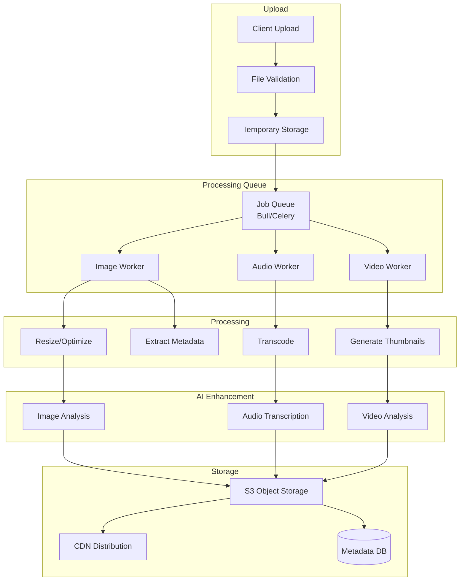

# Multimedia System Design

## Overview

The Multimedia System handles upload, processing, storage, and delivery of images, audio, and video content. It integrates AI capabilities for content enhancement and provides efficient CDN-based delivery.

## Supported Media Types

### Images
- **Formats**: JPEG, PNG, GIF, WebP, SVG, HEIC
- **Max Size**: 50MB per file
- **Features**: Resize, crop, compress, format conversion
- **AI Features**: Alt-text generation, object detection, caption suggestions

### Audio
- **Formats**: MP3, WAV, AAC, OGG, FLAC
- **Max Size**: 100MB per file
- **Features**: Transcoding, compression, waveform generation
- **AI Features**: Transcription, speaker identification, noise reduction

### Video
- **Formats**: MP4, WebM, MOV, AVI
- **Max Size**: 500MB per file
- **Features**: Transcoding, thumbnail generation, compression
- **AI Features**: Scene detection, caption generation, content analysis

## Architecture

### Multimedia Processing Pipeline



## Core Components

### 1. Upload Service

#### Upload Flow

```typescript
interface UploadRequest {
  file: File | Buffer;
  filename: string;
  mimeType: string;
  documentId: string;
  userId: string;
  options?: {
    public?: boolean;
    compress?: boolean;
    generateThumbnail?: boolean;
  };
}

interface UploadResponse {
  id: string;
  url: string;
  thumbnailUrl?: string;
  metadata: MediaMetadata;
  processingStatus: 'pending' | 'processing' | 'complete' | 'failed';
}

class UploadService {
  async upload(request: UploadRequest): Promise<UploadResponse> {
    // 1. Validate file
    await this.validateFile(request);
    
    // 2. Generate unique ID
    const mediaId = generateId();
    
    // 3. Upload to temporary storage
    const tempPath = await this.uploadToTemp(request.file, mediaId);
    
    // 4. Extract basic metadata
    const metadata = await this.extractMetadata(tempPath, request.mimeType);
    
    // 5. Queue for processing
    await this.queueProcessing({
      mediaId,
      tempPath,
      mimeType: request.mimeType,
      options: request.options
    });
    
    // 6. Return immediate response
    return {
      id: mediaId,
      url: this.generateTempUrl(mediaId),
      metadata,
      processingStatus: 'pending'
    };
  }
  
  private async validateFile(request: UploadRequest): Promise<void> {
    // Check file size
    const maxSize = this.getMaxSize(request.mimeType);
    if (request.file.size > maxSize) {
      throw new Error(`File size exceeds maximum of ${maxSize} bytes`);
    }
    
    // Verify MIME type
    const actualMimeType = await this.detectMimeType(request.file);
    if (actualMimeType !== request.mimeType) {
      throw new Error('MIME type mismatch');
    }
    
    // Check for malicious content
    await this.scanForMalware(request.file);
    
    // Validate file format
    await this.validateFormat(request.file, request.mimeType);
  }
}
```

#### Chunked Upload (Large Files)

```typescript
interface ChunkUploadSession {
  sessionId: string;
  mediaId: string;
  totalChunks: number;
  uploadedChunks: Set<number>;
  expiresAt: Date;
}

class ChunkedUploadService {
  async initiate(
    filename: string,
    fileSize: number,
    mimeType: string
  ): Promise<ChunkUploadSession> {
    const sessionId = generateId();
    const mediaId = generateId();
    const chunkSize = 5 * 1024 * 1024; // 5MB chunks
    const totalChunks = Math.ceil(fileSize / chunkSize);
    
    const session: ChunkUploadSession = {
      sessionId,
      mediaId,
      totalChunks,
      uploadedChunks: new Set(),
      expiresAt: new Date(Date.now() + 24 * 60 * 60 * 1000) // 24 hours
    };
    
    await redis.setex(
      `upload:${sessionId}`,
      86400,
      JSON.stringify(session)
    );
    
    return session;
  }
  
  async uploadChunk(
    sessionId: string,
    chunkNumber: number,
    chunk: Buffer
  ): Promise<{ complete: boolean; progress: number }> {
    const session = await this.getSession(sessionId);
    
    // Upload chunk to temporary storage
    await this.storeChunk(session.mediaId, chunkNumber, chunk);
    
    // Update session
    session.uploadedChunks.add(chunkNumber);
    await this.updateSession(session);
    
    const progress = session.uploadedChunks.size / session.totalChunks;
    const complete = session.uploadedChunks.size === session.totalChunks;
    
    if (complete) {
      // Combine chunks and process
      await this.combineChunks(session);
    }
    
    return { complete, progress };
  }
}
```

### 2. Image Processing

```typescript
interface ImageProcessingOptions {
  resize?: {
    width?: number;
    height?: number;
    fit: 'cover' | 'contain' | 'fill';
  };
  format?: 'jpeg' | 'png' | 'webp';
  quality?: number; // 1-100
  compress?: boolean;
  generateThumbnail?: boolean;
}

class ImageProcessor {
  async process(
    imagePath: string,
    options: ImageProcessingOptions
  ): Promise<ProcessedImage> {
    const sharp = require('sharp');
    let pipeline = sharp(imagePath);
    
    // Resize if requested
    if (options.resize) {
      pipeline = pipeline.resize({
        width: options.resize.width,
        height: options.resize.height,
        fit: options.resize.fit
      });
    }
    
    // Convert format
    if (options.format) {
      pipeline = pipeline.toFormat(options.format, {
        quality: options.quality || 85
      });
    }
    
    // Optimize
    if (options.compress) {
      pipeline = pipeline.jpeg({ quality: 80, progressive: true })
                         .png({ compressionLevel: 9 })
                         .webp({ quality: 80 });
    }
    
    // Process image
    const processed = await pipeline.toBuffer();
    
    // Generate thumbnail
    let thumbnail: Buffer | undefined;
    if (options.generateThumbnail) {
      thumbnail = await sharp(imagePath)
        .resize(300, 300, { fit: 'cover' })
        .toBuffer();
    }
    
    // Extract metadata
    const metadata = await sharp(imagePath).metadata();
    
    return {
      data: processed,
      thumbnail,
      metadata: {
        width: metadata.width,
        height: metadata.height,
        format: metadata.format,
        size: processed.length
      }
    };
  }
  
  async generateResponsiveImages(
    imagePath: string
  ): Promise<ResponsiveImageSet> {
    const sizes = [320, 640, 1024, 1920, 2560];
    const images: ResponsiveImage[] = [];
    
    for (const width of sizes) {
      const processed = await this.process(imagePath, {
        resize: { width, fit: 'contain' },
        format: 'webp',
        compress: true
      });
      
      images.push({
        width,
        url: await this.uploadToStorage(processed.data),
        size: processed.metadata.size
      });
    }
    
    return { images };
  }
}
```

### 3. Audio Processing

```typescript
interface AudioProcessingOptions {
  format?: 'mp3' | 'aac' | 'ogg';
  bitrate?: number; // kbps
  sampleRate?: number; // Hz
  channels?: 1 | 2; // mono or stereo
  normalize?: boolean;
  generateWaveform?: boolean;
  transcribe?: boolean;
}

class AudioProcessor {
  async process(
    audioPath: string,
    options: AudioProcessingOptions
  ): Promise<ProcessedAudio> {
    const ffmpeg = require('fluent-ffmpeg');
    
    // Transcode audio
    const outputPath = await this.transcode(audioPath, {
      format: options.format || 'mp3',
      bitrate: options.bitrate || 128,
      sampleRate: options.sampleRate || 44100,
      channels: options.channels || 2
    });
    
    // Normalize audio levels
    if (options.normalize) {
      await this.normalize(outputPath);
    }
    
    // Generate waveform
    let waveform: number[] | undefined;
    if (options.generateWaveform) {
      waveform = await this.generateWaveform(outputPath);
    }
    
    // Transcribe audio
    let transcription: Transcription | undefined;
    if (options.transcribe) {
      transcription = await this.transcribe(outputPath);
    }
    
    // Extract metadata
    const metadata = await this.extractAudioMetadata(outputPath);
    
    return {
      path: outputPath,
      waveform,
      transcription,
      metadata
    };
  }
  
  private async transcode(
    inputPath: string,
    options: TranscodeOptions
  ): Promise<string> {
    const outputPath = `${inputPath}.${options.format}`;
    
    return new Promise((resolve, reject) => {
      ffmpeg(inputPath)
        .audioCodec(this.getCodec(options.format))
        .audioBitrate(options.bitrate)
        .audioFrequency(options.sampleRate)
        .audioChannels(options.channels)
        .on('end', () => resolve(outputPath))
        .on('error', reject)
        .save(outputPath);
    });
  }
  
  private async generateWaveform(audioPath: string): Promise<number[]> {
    // Extract audio samples
    const samples = await this.extractSamples(audioPath, 1000);
    
    // Calculate RMS for each sample window
    return samples.map(window => {
      const rms = Math.sqrt(
        window.reduce((sum, sample) => sum + sample * sample, 0) / window.length
      );
      return rms;
    });
  }
  
  private async transcribe(audioPath: string): Promise<Transcription> {
    // Use OpenAI Whisper or similar service
    const response = await openai.audio.transcriptions.create({
      file: fs.createReadStream(audioPath),
      model: 'whisper-1',
      response_format: 'verbose_json',
      timestamp_granularities: ['word', 'segment']
    });
    
    return {
      text: response.text,
      language: response.language,
      duration: response.duration,
      words: response.words,
      segments: response.segments
    };
  }
}
```

### 4. Video Processing

```typescript
interface VideoProcessingOptions {
  format?: 'mp4' | 'webm';
  resolution?: '480p' | '720p' | '1080p' | '4k';
  codec?: 'h264' | 'h265' | 'vp9';
  bitrate?: number;
  generateThumbnails?: boolean;
  thumbnailCount?: number;
  extractAudio?: boolean;
  generatePreview?: boolean;
}

class VideoProcessor {
  async process(
    videoPath: string,
    options: VideoProcessingOptions
  ): Promise<ProcessedVideo> {
    const ffmpeg = require('fluent-ffmpeg');
    
    // Transcode video
    const outputPath = await this.transcode(videoPath, options);
    
    // Generate thumbnails
    let thumbnails: string[] = [];
    if (options.generateThumbnails) {
      thumbnails = await this.generateThumbnails(
        videoPath,
        options.thumbnailCount || 5
      );
    }
    
    // Extract audio track
    let audioPath: string | undefined;
    if (options.extractAudio) {
      audioPath = await this.extractAudio(videoPath);
    }
    
    // Generate preview clip
    let previewPath: string | undefined;
    if (options.generatePreview) {
      previewPath = await this.generatePreview(videoPath);
    }
    
    // Extract metadata
    const metadata = await this.extractVideoMetadata(outputPath);
    
    return {
      path: outputPath,
      thumbnails,
      audioPath,
      previewPath,
      metadata
    };
  }
  
  private async transcode(
    inputPath: string,
    options: VideoProcessingOptions
  ): Promise<string> {
    const outputPath = `${inputPath}.${options.format || 'mp4'}`;
    const resolution = this.getResolution(options.resolution || '720p');
    
    return new Promise((resolve, reject) => {
      ffmpeg(inputPath)
        .videoCodec(this.getVideoCodec(options.codec || 'h264'))
        .size(resolution)
        .videoBitrate(options.bitrate || 2000)
        .audioCodec('aac')
        .audioBitrate(128)
        .on('end', () => resolve(outputPath))
        .on('error', reject)
        .on('progress', progress => {
          console.log(`Processing: ${progress.percent}% done`);
        })
        .save(outputPath);
    });
  }
  
  private async generateThumbnails(
    videoPath: string,
    count: number
  ): Promise<string[]> {
    const metadata = await this.extractVideoMetadata(videoPath);
    const duration = metadata.duration;
    const interval = duration / (count + 1);
    
    const thumbnails: string[] = [];
    
    for (let i = 1; i <= count; i++) {
      const timestamp = interval * i;
      const thumbnailPath = await this.extractFrame(videoPath, timestamp);
      thumbnails.push(thumbnailPath);
    }
    
    return thumbnails;
  }
  
  private async extractFrame(
    videoPath: string,
    timestamp: number
  ): Promise<string> {
    const outputPath = `${videoPath}_thumb_${timestamp}.jpg`;
    
    return new Promise((resolve, reject) => {
      ffmpeg(videoPath)
        .screenshots({
          timestamps: [timestamp],
          filename: path.basename(outputPath),
          folder: path.dirname(outputPath)
        })
        .on('end', () => resolve(outputPath))
        .on('error', reject);
    });
  }
  
  private async generatePreview(
    videoPath: string,
    duration: number = 10
  ): Promise<string> {
    const outputPath = `${videoPath}_preview.mp4`;
    
    return new Promise((resolve, reject) => {
      ffmpeg(videoPath)
        .setStartTime(0)
        .setDuration(duration)
        .size('640x360')
        .videoBitrate(500)
        .on('end', () => resolve(outputPath))
        .on('error', reject)
        .save(outputPath);
    });
  }
}
```

### 5. AI Enhancement

```typescript
class MediaAIService {
  // Image Analysis
  async analyzeImage(imagePath: string): Promise<ImageAnalysis> {
    const imageUrl = await this.uploadForAnalysis(imagePath);
    
    const response = await openai.chat.completions.create({
      model: 'gpt-4-vision-preview',
      messages: [{
        role: 'user',
        content: [
          {
            type: 'text',
            text: `Analyze this image and provide:
1. A detailed description
2. Suitable alt-text for accessibility
3. A suggested caption
4. Detected objects and their locations
5. Relevant tags`
          },
          {
            type: 'image_url',
            image_url: { url: imageUrl }
          }
        ]
      }],
      max_tokens: 500
    });
    
    return this.parseImageAnalysis(response.choices[0].message.content);
  }
  
  // Audio Transcription with Speaker Identification
  async transcribeWithSpeakers(audioPath: string): Promise<TranscriptionWithSpeakers> {
    // Use service like AssemblyAI or Deepgram
    const response = await assemblyai.transcribe({
      audio_url: await this.uploadForAnalysis(audioPath),
      speaker_labels: true,
      auto_highlights: true
    });
    
    return {
      text: response.text,
      speakers: response.utterances.map(u => ({
        speaker: u.speaker,
        text: u.text,
        start: u.start,
        end: u.end,
        confidence: u.confidence
      })),
      highlights: response.auto_highlights_result.results
    };
  }
  
  // Video Scene Detection
  async detectScenes(videoPath: string): Promise<Scene[]> {
    const frames = await this.extractKeyFrames(videoPath);
    const scenes: Scene[] = [];
    
    for (const frame of frames) {
      const analysis = await this.analyzeImage(frame.path);
      scenes.push({
        timestamp: frame.timestamp,
        description: analysis.description,
        objects: analysis.detectedObjects,
        tags: analysis.tags
      });
    }
    
    return scenes;
  }
  
  // Content Moderation
  async moderateContent(mediaPath: string, type: 'image' | 'video'): Promise<ModerationResult> {
    // Use service like AWS Rekognition or Google Cloud Vision
    const response = await rekognition.detectModerationLabels({
      Image: {
        Bytes: fs.readFileSync(mediaPath)
      }
    });
    
    const inappropriate = response.ModerationLabels.filter(
      label => label.Confidence > 80
    );
    
    return {
      safe: inappropriate.length === 0,
      flags: inappropriate.map(label => ({
        category: label.Name,
        confidence: label.Confidence,
        parentCategory: label.ParentName
      }))
    };
  }
}
```

## Storage & Delivery

### Storage Strategy

```typescript
interface StorageConfig {
  provider: 's3' | 'gcs' | 'azure';
  bucket: string;
  region: string;
  cdn: {
    enabled: boolean;
    domain: string;
  };
}

class MediaStorage {
  async store(
    mediaId: string,
    data: Buffer,
    metadata: MediaMetadata
  ): Promise<StorageResult> {
    // Generate storage path
    const path = this.generatePath(mediaId, metadata);
    
    // Upload to object storage
    await s3.putObject({
      Bucket: config.bucket,
      Key: path,
      Body: data,
      ContentType: metadata.mimeType,
      Metadata: {
        userId: metadata.userId,
        documentId: metadata.documentId,
        originalName: metadata.originalName
      },
      CacheControl: 'public, max-age=31536000', // 1 year
      ACL: metadata.public ? 'public-read' : 'private'
    });
    
    // Generate URLs
    const url = this.generateUrl(path);
    const cdnUrl = config.cdn.enabled
      ? this.generateCdnUrl(path)
      : url;
    
    // Store metadata in database
    await db.media.insert({
      id: mediaId,
      path,
      url: cdnUrl,
      ...metadata
    });
    
    return {
      id: mediaId,
      url: cdnUrl,
      path
    };
  }
  
  private generatePath(mediaId: string, metadata: MediaMetadata): string {
    const date = new Date();
    const year = date.getFullYear();
    const month = String(date.getMonth() + 1).padStart(2, '0');
    const ext = this.getExtension(metadata.mimeType);
    
    // Organize by date for better management
    return `media/${year}/${month}/${mediaId}${ext}`;
  }
  
  async getSignedUrl(
    mediaId: string,
    expiresIn: number = 3600
  ): Promise<string> {
    const media = await db.media.findById(mediaId);
    
    return s3.getSignedUrl('getObject', {
      Bucket: config.bucket,
      Key: media.path,
      Expires: expiresIn
    });
  }
}
```

### CDN Configuration

```typescript
interface CDNConfig {
  provider: 'cloudfront' | 'cloudflare' | 'fastly';
  domain: string;
  caching: {
    defaultTTL: number;
    maxTTL: number;
    minTTL: number;
  };
  optimization: {
    imageOptimization: boolean;
    videoOptimization: boolean;
    compression: boolean;
  };
}

class CDNService {
  async invalidate(paths: string[]): Promise<void> {
    // Invalidate CDN cache for updated media
    await cloudfront.createInvalidation({
      DistributionId: config.distributionId,
      InvalidationBatch: {
        Paths: {
          Quantity: paths.length,
          Items: paths
        },
        CallerReference: Date.now().toString()
      }
    });
  }
  
  generateOptimizedUrl(
    mediaUrl: string,
    options: ImageOptimizationOptions
  ): string {
    // Use CDN image optimization features
    const params = new URLSearchParams();
    
    if (options.width) params.set('w', options.width.toString());
    if (options.height) params.set('h', options.height.toString());
    if (options.quality) params.set('q', options.quality.toString());
    if (options.format) params.set('f', options.format);
    
    return `${mediaUrl}?${params.toString()}`;
  }
}
```

## Data Models

### Media Table (MongoDB)

```typescript
interface MediaDocument {
  _id: string;
  userId: string;
  documentId: string;
  
  // File info
  originalName: string;
  mimeType: string;
  size: number;
  
  // Storage
  path: string;
  url: string;
  thumbnailUrl?: string;
  
  // Processing
  processingStatus: 'pending' | 'processing' | 'complete' | 'failed';
  processedAt?: Date;
  
  // Metadata
  metadata: {
    width?: number;
    height?: number;
    duration?: number;
    format?: string;
    codec?: string;
    bitrate?: number;
  };
  
  // AI enhancements
  aiData?: {
    altText?: string;
    caption?: string;
    tags?: string[];
    transcription?: string;
    objects?: DetectedObject[];
  };
  
  // Timestamps
  createdAt: Date;
  updatedAt: Date;
}
```

## API Endpoints

```
POST   /api/media/upload              - Upload media file
POST   /api/media/upload/chunked      - Initiate chunked upload
PUT    /api/media/upload/chunked/:id  - Upload chunk
GET    /api/media/:id                 - Get media details
DELETE /api/media/:id                 - Delete media
GET    /api/media/:id/download        - Download media
POST   /api/media/:id/analyze         - Trigger AI analysis
GET    /api/media/:id/transcription   - Get transcription
POST   /api/media/:id/thumbnail       - Generate thumbnail
GET    /api/media/search              - Search media
```

## Performance Optimization

### Lazy Loading
- Load thumbnails first, full media on demand
- Progressive image loading (blur-up technique)
- Lazy load videos (poster image first)

### Compression
- Automatic format selection (WebP for images)
- Adaptive bitrate for videos
- Audio compression based on content type

### Caching
- Browser caching (long TTL for immutable files)
- CDN edge caching
- Application-level caching for metadata

## Security

### Access Control
- Signed URLs for private media
- Permission checks on all operations
- Rate limiting on uploads

### Content Security
- Malware scanning on upload
- Content moderation for public media
- EXIF data stripping for privacy

### Data Protection
- Encryption at rest (S3 encryption)
- Encryption in transit (HTTPS/TLS)
- Secure deletion (overwrite before delete)

## Monitoring

### Key Metrics
- Upload success rate
- Processing time per media type
- Storage usage per user
- CDN hit rate
- Bandwidth usage

### Alerts
- Failed uploads
- Processing failures
- Storage quota exceeded
- High bandwidth usage

## Future Enhancements

- **Live Streaming**: Real-time video streaming
- **360° Media**: Support for panoramic images/videos
- **AR/VR Content**: 3D models and immersive media
- **Advanced Editing**: In-browser media editing
- **Collaborative Annotation**: Multi-user media markup
- **Version Control**: Track media changes over time