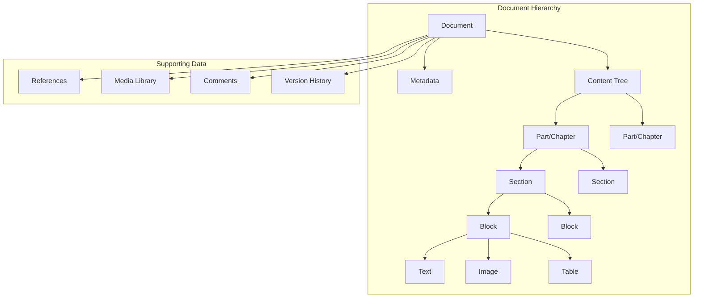

# Document System Design

## Overview

The Document System manages the core document structure, formatting, templates, versioning, and export capabilities. It provides a flexible foundation for various document types including papers, books, novels, and reports.

## Document Types

### Supported Document Types

1. **Academic Paper**
   - Abstract, sections, references
   - Citation management
   - Figure and table numbering
   - LaTeX export support

2. **Book/Novel**
   - Chapters and parts
   - Table of contents
   - Front matter and back matter
   - EPUB export support

3. **Report**
   - Executive summary
   - Sections and subsections
   - Charts and graphs
   - Professional formatting

4. **Article/Blog Post**
   - Title, subtitle, body
   - Featured image
   - Tags and categories
   - HTML/Markdown export

5. **Presentation**
   - Slides with layouts
   - Speaker notes
   - Multimedia integration
   - PDF/PowerPoint export

## Architecture

### Document Structure



## Core Components

### 1. Document Model

```typescript
interface Document {
  id: string;
  
  // Metadata
  metadata: DocumentMetadata;
  
  // Content
  content: ContentNode;
  
  // Structure
  outline: OutlineNode[];
  
  // References
  bibliography: Reference[];
  citations: Citation[];
  
  // Media
  media: MediaReference[];
  
  // Collaboration
  permissions: Permission[];
  comments: Comment[];
  
  // Versioning
  version: number;
  versionHistory: Version[];
  
  // Timestamps
  createdAt: Date;
  updatedAt: Date;
  publishedAt?: Date;
}

interface DocumentMetadata {
  // Basic info
  title: string;
  subtitle?: string;
  type: DocumentType;
  
  // Authors
  authors: Author[];
  
  // Classification
  tags: string[];
  categories: string[];
  keywords: string[];
  
  // Academic
  abstract?: string;
  doi?: string;
  journal?: string;
  
  // Publishing
  status: 'draft' | 'review' | 'published' | 'archived';
  language: string;
  
  // Formatting
  template: string;
  style: StyleConfig;
  
  // Statistics
  stats: {
    wordCount: number;
    characterCount: number;
    pageCount: number;
    readingTime: number; // minutes
  };
}

interface Author {
  id: string;
  name: string;
  email?: string;
  affiliation?: string;
  orcid?: string;
  role: 'primary' | 'contributor' | 'editor';
}
```

### 2. Content Structure

```typescript
// Block-based content structure (similar to Notion)
type ContentNode = 
  | TextBlock
  | HeadingBlock
  | ParagraphBlock
  | ListBlock
  | CodeBlock
  | QuoteBlock
  | ImageBlock
  | VideoBlock
  | AudioBlock
  | TableBlock
  | EquationBlock
  | EmbedBlock
  | DividerBlock;

interface BaseBlock {
  id: string;
  type: string;
  children?: ContentNode[];
  metadata?: Record<string, any>;
}

interface TextBlock extends BaseBlock {
  type: 'text';
  content: FormattedText;
}

interface FormattedText {
  text: string;
  marks?: TextMark[];
}

interface TextMark {
  type: 'bold' | 'italic' | 'underline' | 'strikethrough' | 'code' | 'link' | 'highlight';
  start: number;
  end: number;
  attributes?: Record<string, any>;
}

interface HeadingBlock extends BaseBlock {
  type: 'heading';
  level: 1 | 2 | 3 | 4 | 5 | 6;
  content: FormattedText;
  id: string; // For anchor links
}

interface ParagraphBlock extends BaseBlock {
  type: 'paragraph';
  content: FormattedText;
  alignment?: 'left' | 'center' | 'right' | 'justify';
}

interface ListBlock extends BaseBlock {
  type: 'list';
  listType: 'ordered' | 'unordered' | 'checklist';
  items: ListItem[];
}

interface ListItem {
  id: string;
  content: FormattedText;
  checked?: boolean; // For checklist
  children?: ListItem[];
}

interface CodeBlock extends BaseBlock {
  type: 'code';
  language: string;
  code: string;
  showLineNumbers?: boolean;
  highlightLines?: number[];
}

interface ImageBlock extends BaseBlock {
  type: 'image';
  mediaId: string;
  url: string;
  alt: string;
  caption?: FormattedText;
  width?: number;
  height?: number;
  alignment?: 'left' | 'center' | 'right';
}

interface TableBlock extends BaseBlock {
  type: 'table';
  caption?: FormattedText;
  headers: TableCell[];
  rows: TableRow[];
}

interface TableRow {
  id: string;
  cells: TableCell[];
}

interface TableCell {
  id: string;
  content: FormattedText;
  colspan?: number;
  rowspan?: number;
  alignment?: 'left' | 'center' | 'right';
}

interface EquationBlock extends BaseBlock {
  type: 'equation';
  latex: string;
  display: 'inline' | 'block';
}
```

### 3. Template System

```typescript
interface DocumentTemplate {
  id: string;
  name: string;
  description: string;
  type: DocumentType;
  
  // Structure
  structure: TemplateStructure;
  
  // Styling
  styles: StyleConfig;
  
  // Metadata
  category: string;
  tags: string[];
  preview: string; // URL to preview image
  
  // Usage
  usageCount: number;
  rating: number;
  
  // Ownership
  isPublic: boolean;
  createdBy: string;
  createdAt: Date;
}

interface TemplateStructure {
  sections: TemplateSection[];
  defaultBlocks: ContentNode[];
}

interface TemplateSection {
  id: string;
  name: string;
  description?: string;
  required: boolean;
  order: number;
  defaultContent?: ContentNode[];
}

interface StyleConfig {
  // Typography
  fonts: {
    heading: FontConfig;
    body: FontConfig;
    code: FontConfig;
  };
  
  // Colors
  colors: {
    primary: string;
    secondary: string;
    text: string;
    background: string;
    accent: string;
  };
  
  // Spacing
  spacing: {
    lineHeight: number;
    paragraphSpacing: number;
    sectionSpacing: number;
  };
  
  // Layout
  layout: {
    maxWidth: number;
    margins: {
      top: number;
      right: number;
      bottom: number;
      left: number;
    };
    columns?: number;
  };
  
  // Page
  page: {
    size: 'A4' | 'Letter' | 'Legal' | 'Custom';
    orientation: 'portrait' | 'landscape';
    customSize?: { width: number; height: number };
  };
}

interface FontConfig {
  family: string;
  size: number;
  weight: number;
  lineHeight: number;
}
```

### 4. Citation Management

```typescript
interface Reference {
  id: string;
  type: 'article' | 'book' | 'website' | 'conference' | 'thesis' | 'other';
  
  // Common fields
  title: string;
  authors: string[];
  year: number;
  
  // Article-specific
  journal?: string;
  volume?: string;
  issue?: string;
  pages?: string;
  doi?: string;
  
  // Book-specific
  publisher?: string;
  isbn?: string;
  edition?: string;
  
  // Web-specific
  url?: string;
  accessDate?: Date;
  
  // Additional
  abstract?: string;
  keywords?: string[];
  notes?: string;
}

interface Citation {
  id: string;
  referenceId: string;
  location: {
    blockId: string;
    position: number;
  };
  citationStyle: 'inline' | 'footnote' | 'endnote';
  customText?: string;
}

class CitationManager {
  async addReference(reference: Reference): Promise<string> {
    // Validate reference
    this.validateReference(reference);
    
    // Check for duplicates
    const existing = await this.findDuplicate(reference);
    if (existing) {
      return existing.id;
    }
    
    // Store reference
    const id = await db.references.insert(reference);
    
    return id;
  }
  
  async insertCitation(
    documentId: string,
    referenceId: string,
    location: CitationLocation
  ): Promise<Citation> {
    const citation: Citation = {
      id: generateId(),
      referenceId,
      location,
      citationStyle: 'inline'
    };
    
    await db.citations.insert(citation);
    
    // Update document
    await this.updateDocumentCitations(documentId);
    
    return citation;
  }
  
  async formatBibliography(
    documentId: string,
    style: 'apa' | 'mla' | 'chicago' | 'ieee'
  ): Promise<string> {
    const references = await this.getDocumentReferences(documentId);
    
    // Sort references
    const sorted = this.sortReferences(references, style);
    
    // Format each reference
    const formatted = sorted.map(ref => 
      this.formatReference(ref, style)
    );
    
    return formatted.join('\n\n');
  }
  
  private formatReference(
    reference: Reference,
    style: string
  ): string {
    // Use citation-js or similar library
    const Cite = require('citation-js');
    const cite = new Cite(reference);
    return cite.format('bibliography', {
      format: 'text',
      template: style
    });
  }
}
```

### 5. Version Control

```typescript
interface Version {
  id: string;
  documentId: string;
  version: number;
  
  // Snapshot
  snapshot: DocumentSnapshot;
  
  // Changes
  changes: Change[];
  changeSummary: string;
  
  // Metadata
  createdBy: string;
  createdAt: Date;
  
  // Tags
  tag?: string; // e.g., "v1.0", "draft-1", "final"
  message?: string;
}

interface DocumentSnapshot {
  metadata: DocumentMetadata;
  content: ContentNode;
  references: Reference[];
}

interface Change {
  type: 'add' | 'modify' | 'delete';
  path: string; // JSON path to changed element
  before?: any;
  after?: any;
}

class VersionControl {
  async createVersion(
    documentId: string,
    message?: string,
    tag?: string
  ): Promise<Version> {
    const document = await db.documents.findById(documentId);
    
    // Create snapshot
    const snapshot: DocumentSnapshot = {
      metadata: document.metadata,
      content: document.content,
      references: document.bibliography
    };
    
    // Calculate changes from previous version
    const previousVersion = await this.getLatestVersion(documentId);
    const changes = previousVersion
      ? this.calculateChanges(previousVersion.snapshot, snapshot)
      : [];
    
    // Create version
    const version: Version = {
      id: generateId(),
      documentId,
      version: document.version + 1,
      snapshot,
      changes,
      changeSummary: this.summarizeChanges(changes),
      createdBy: document.userId,
      createdAt: new Date(),
      tag,
      message
    };
    
    await db.versions.insert(version);
    
    // Update document version number
    await db.documents.update(documentId, {
      version: version.version
    });
    
    return version;
  }
  
  async restoreVersion(
    documentId: string,
    versionId: string
  ): Promise<Document> {
    const version = await db.versions.findById(versionId);
    
    // Create new version before restoring
    await this.createVersion(documentId, `Restore to version ${version.version}`);
    
    // Restore snapshot
    await db.documents.update(documentId, {
      metadata: version.snapshot.metadata,
      content: version.snapshot.content,
      bibliography: version.snapshot.references,
      version: version.version
    });
    
    return await db.documents.findById(documentId);
  }
  
  async compareVersions(
    versionId1: string,
    versionId2: string
  ): Promise<Change[]> {
    const v1 = await db.versions.findById(versionId1);
    const v2 = await db.versions.findById(versionId2);
    
    return this.calculateChanges(v1.snapshot, v2.snapshot);
  }
  
  private calculateChanges(
    before: DocumentSnapshot,
    after: DocumentSnapshot
  ): Change[] {
    // Use diff library like jsondiffpatch
    const delta = jsondiffpatch.diff(before, after);
    return this.parseDelta(delta);
  }
}
```

### 6. Export System

```typescript
interface ExportOptions {
  format: 'pdf' | 'docx' | 'latex' | 'html' | 'markdown' | 'epub';
  
  // PDF options
  pdf?: {
    pageSize: 'A4' | 'Letter';
    margins: { top: number; right: number; bottom: number; left: number };
    includeTableOfContents: boolean;
    includeCoverPage: boolean;
    headerFooter?: {
      header?: string;
      footer?: string;
      pageNumbers: boolean;
    };
  };
  
  // DOCX options
  docx?: {
    includeComments: boolean;
    trackChanges: boolean;
  };
  
  // LaTeX options
  latex?: {
    documentClass: 'article' | 'book' | 'report';
    packages: string[];
  };
  
  // EPUB options
  epub?: {
    coverImage?: string;
    metadata: {
      isbn?: string;
      publisher?: string;
    };
  };
}

class ExportService {
  async export(
    documentId: string,
    options: ExportOptions
  ): Promise<ExportResult> {
    const document = await db.documents.findById(documentId);
    
    // Queue export job
    const jobId = await this.queueExport(document, options);
    
    return {
      jobId,
      status: 'queued',
      estimatedTime: this.estimateExportTime(document, options.format)
    };
  }
  
  private async exportToPDF(
    document: Document,
    options: ExportOptions['pdf']
  ): Promise<Buffer> {
    // Convert document to HTML
    const html = await this.convertToHTML(document);
    
    // Apply styling
    const styled = this.applyStyles(html, document.metadata.style);
    
    // Generate PDF using Puppeteer
    const browser = await puppeteer.launch();
    const page = await browser.newPage();
    
    await page.setContent(styled);
    
    const pdf = await page.pdf({
      format: options.pageSize,
      margin: options.margins,
      displayHeaderFooter: !!options.headerFooter,
      headerTemplate: options.headerFooter?.header,
      footerTemplate: options.headerFooter?.footer,
      printBackground: true
    });
    
    await browser.close();
    
    return pdf;
  }
  
  private async exportToDOCX(
    document: Document,
    options: ExportOptions['docx']
  ): Promise<Buffer> {
    const docx = require('docx');
    const { Document, Paragraph, TextRun, HeadingLevel } = docx;
    
    // Convert content to DOCX structure
    const sections = this.convertToDocxSections(document.content);
    
    const doc = new Document({
      sections: [{
        properties: {},
        children: sections
      }]
    });
    
    return await docx.Packer.toBuffer(doc);
  }
  
  private async exportToLaTeX(
    document: Document,
    options: ExportOptions['latex']
  ): Promise<string> {
    let latex = `\\documentclass{${options.documentClass}}\n\n`;
    
    // Add packages
    options.packages.forEach(pkg => {
      latex += `\\usepackage{${pkg}}\n`;
    });
    
    // Add metadata
    latex += `\n\\title{${this.escapeLatex(document.metadata.title)}}\n`;
    latex += `\\author{${document.metadata.authors.map(a => a.name).join(', ')}}\n`;
    latex += `\\date{${new Date().toLocaleDateString()}}\n\n`;
    
    latex += `\\begin{document}\n\n`;
    latex += `\\maketitle\n\n`;
    
    // Convert content
    latex += this.convertToLatex(document.content);
    
    // Add bibliography
    if (document.bibliography.length > 0) {
      latex += `\n\\bibliographystyle{plain}\n`;
      latex += `\\bibliography{references}\n`;
    }
    
    latex += `\n\\end{document}`;
    
    return latex;
  }
  
  private async exportToEPUB(
    document: Document,
    options: ExportOptions['epub']
  ): Promise<Buffer> {
    const EPub = require('epub-gen');
    
    const epub = new EPub({
      title: document.metadata.title,
      author: document.metadata.authors.map(a => a.name),
      cover: options.coverImage,
      content: this.convertToEPUBChapters(document.content)
    });
    
    return await epub.generate();
  }
}
```

## Document Operations

### Search & Filter

```typescript
interface SearchQuery {
  text?: string;
  filters?: {
    type?: DocumentType[];
    status?: DocumentStatus[];
    tags?: string[];
    authors?: string[];
    dateRange?: {
      start: Date;
      end: Date;
    };
  };
  sort?: {
    field: 'title' | 'createdAt' | 'updatedAt' | 'wordCount';
    order: 'asc' | 'desc';
  };
  pagination?: {
    page: number;
    limit: number;
  };
}

class DocumentSearch {
  async search(query: SearchQuery): Promise<SearchResult> {
    // Build search query
    const searchQuery = this.buildQuery(query);
    
    // Execute search
    const results = await db.documents.search(searchQuery);
    
    // Apply filters
    const filtered = this.applyFilters(results, query.filters);
    
    // Sort results
    const sorted = this.sortResults(filtered, query.sort);
    
    // Paginate
    const paginated = this.paginate(sorted, query.pagination);
    
    return {
      documents: paginated,
      total: filtered.length,
      page: query.pagination?.page || 1,
      totalPages: Math.ceil(filtered.length / (query.pagination?.limit || 10))
    };
  }
  
  async fullTextSearch(text: string): Promise<Document[]> {
    // Use full-text search index
    return await db.documents.fullTextSearch(text);
  }
}
```

### Duplicate & Template

```typescript
class DocumentOperations {
  async duplicate(documentId: string): Promise<Document> {
    const original = await db.documents.findById(documentId);
    
    const duplicate: Document = {
      ...original,
      id: generateId(),
      metadata: {
        ...original.metadata,
        title: `${original.metadata.title} (Copy)`,
        status: 'draft'
      },
      createdAt: new Date(),
      updatedAt: new Date()
    };
    
    await db.documents.insert(duplicate);
    
    return duplicate;
  }
  
  async createFromTemplate(
    templateId: string,
    metadata: Partial<DocumentMetadata>
  ): Promise<Document> {
    const template = await db.templates.findById(templateId);
    
    const document: Document = {
      id: generateId(),
      metadata: {
        ...template.structure.defaultMetadata,
        ...metadata,
        template: templateId
      },
      content: this.cloneContent(template.structure.defaultBlocks),
      outline: [],
      bibliography: [],
      citations: [],
      media: [],
      permissions: [],
      comments: [],
      version: 1,
      versionHistory: [],
      createdAt: new Date(),
      updatedAt: new Date()
    };
    
    await db.documents.insert(document);
    
    return document;
  }
}
```

## Data Models

### Document Table (MongoDB)

```typescript
// Stored in MongoDB for flexible schema
interface DocumentRecord {
  _id: string;
  userId: string;
  workspaceId: string;
  
  metadata: DocumentMetadata;
  content: ContentNode;
  outline: OutlineNode[];
  
  bibliography: Reference[];
  citations: Citation[];
  media: MediaReference[];
  
  permissions: Permission[];
  comments: Comment[];
  
  version: number;
  
  createdAt: Date;
  updatedAt: Date;
  publishedAt?: Date;
  
  // Indexes
  _textScore?: number; // For full-text search
}

// Indexes
db.documents.createIndex({ userId: 1, workspaceId: 1 });
db.documents.createIndex({ 'metadata.title': 'text', 'content': 'text' });
db.documents.createIndex({ 'metadata.type': 1 });
db.documents.createIndex({ 'metadata.status': 1 });
db.documents.createIndex({ 'metadata.tags': 1 });
db.documents.createIndex({ updatedAt: -1 });
```

## API Endpoints

```
POST   /api/documents                    - Create document
GET    /api/documents                    - List documents
GET    /api/documents/:id                - Get document
PUT    /api/documents/:id                - Update document
DELETE /api/documents/:id                - Delete document
POST   /api/documents/:id/duplicate      - Duplicate document

GET    /api/documents/:id/versions       - List versions
POST   /api/documents/:id/versions       - Create version
POST   /api/documents/:id/restore/:vid   - Restore version

POST   /api/documents/:id/export         - Export document
GET    /api/documents/:id/export/:jobId  - Get export status

GET    /api/documents/search             - Search documents
GET    /api/documents/templates          - List templates
POST   /api/documents/from-template      - Create from template

POST   /api/documents/:id/references     - Add reference
PUT    /api/documents/:id/references/:rid - Update reference
DELETE /api/documents/:id/references/:rid - Delete reference
POST   /api/documents/:id/citations      - Insert citation
```

## Performance Optimization

### Lazy Loading
- Load document metadata first
- Load content in chunks for large documents
- Lazy load media references

### Caching
- Cache frequently accessed documents
- Cache rendered output
- Cache export results

### Indexing
- Full-text search index
- Metadata indexes for filtering
- Compound indexes for common queries

## Security

### Access Control
- Document-level permissions
- Version history access control
- Export permission checks

### Data Validation
- Schema validation on save
- Content sanitization
- Reference validation

## Monitoring

### Key Metrics
- Document creation rate
- Average document size
- Export success rate
- Search performance
- Version creation frequency

## Future Enhancements

- **Real-time Collaboration**: Live editing indicators
- **Advanced Templates**: Conditional sections, variables
- **Smart Suggestions**: AI-powered structure recommendations
- **Version Branching**: Git-like branching for documents
- **Advanced Export**: Custom export templates
- **Document Linking**: Cross-document references
- **Workflow Automation**: Approval workflows, publishing pipelines